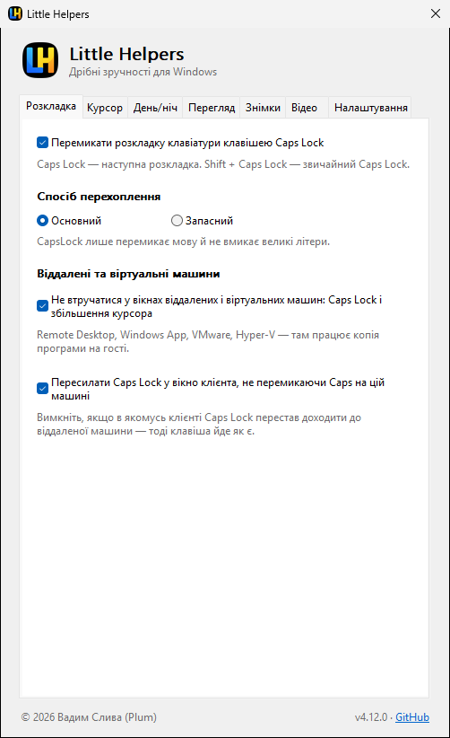
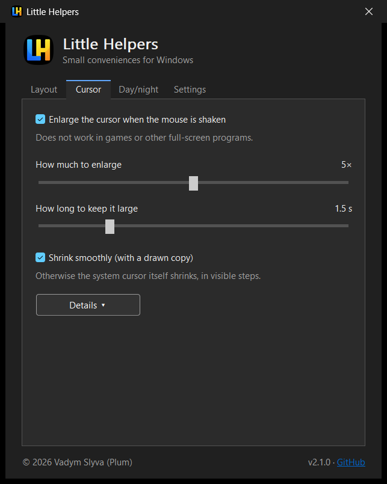
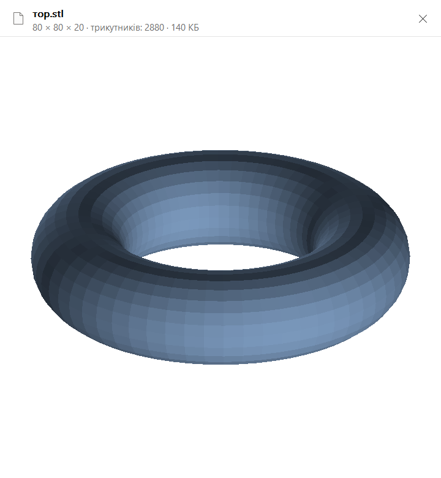
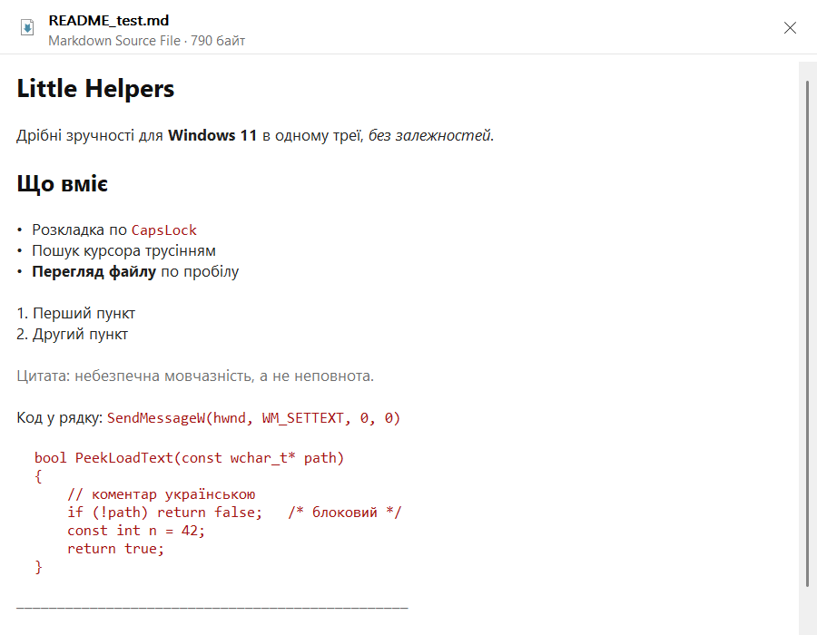
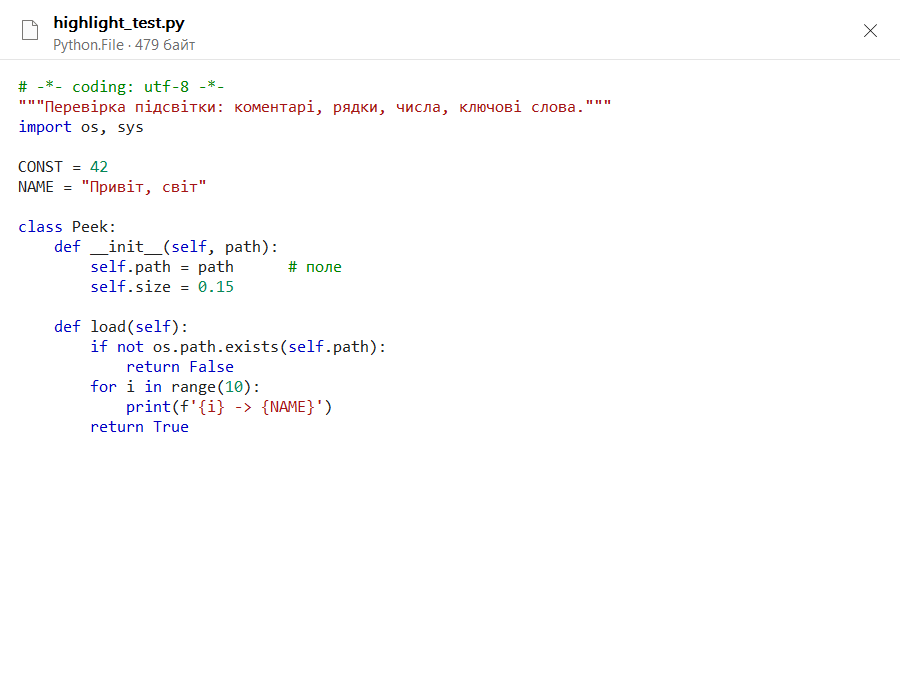
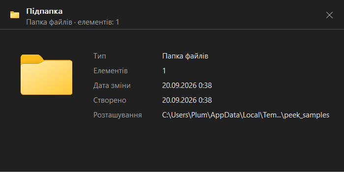

# Little Helpers

[Українська](README.md) · **English**


Small Windows 11 conveniences in one tray app. No dependencies, a single exe:

- **Layout** — CapsLock switches the keyboard layout; Shift + CapsLock is the
  regular Caps Lock.
- **Cursor** — shake the mouse and the cursor briefly grows big (as on macOS).
- **Day/night** — light/dark Windows theme by sunrise and sunset or on a
  schedule.
- **Preview** — Space in Explorer shows the selected file, like Quick Look on
  macOS or Peek in PowerToys: images (incl. WebP) and SVG, PDF, STL models
  with seven views, text and code with highlighting, Markdown, docx, formatted
  JSON; video and audio play right in the preview window. ⚠ Experimental,
  since 2.2.0.
- **Screenshots and screen recording moved to [Znimok](https://github.com/V-Plum/znimok)**
  (since 4.15.0) — a separate Rust app for Windows and macOS: shots, recording,
  the editor, the library and the DevTools log with its
  [Chrome extension](https://chromewebstore.google.com/detail/jhnaichejniloonjcimjpfeggkmcmpek).
  The "Znimok" tab in the window points there. Versions up to 4.14 still had
  these features; `.lhshot`, `.lhvideo` and `.lhreport` files no longer open here.
- **Dark theme for the app window itself**, auto-updates from GitHub Releases
  with signature verification.
- **Ukrainian and English** UI — from the Windows language or chosen by hand.

| Light theme, Ukrainian | Dark theme, English |
|---|---|
|  |  |

## Layout

The key can be intercepted in two ways; the switch is on the **Layout** tab
(stored in `HKCU\Software\lilhelpers`, `Mode`):

- **Primary** — a low-level keyboard hook that swallows CapsLock (`return 1`).
  The only way to keep Caps Lock from toggling. The callback does nothing but
  `PostMessage` to the main window: anything heavier risks missing
  `LowLevelHooksTimeout`, after which Windows silently removes the hook. The
  hook itself lives on a **separate thread** with its own message loop, so a
  busy UI thread (for example, synchronous Task Scheduler COM calls when
  enabling autostart) cannot starve the callback.
- **Fallback** — `RegisterHotKey(VK_CAPITAL, MOD_NOREPEAT)`. It intercepts
  nothing and doesn't irritate security software, but Windows **still toggles
  Caps Lock**: the toggle happens a level below the delivery of `WM_HOTKEY`.
  It can't be undone by injecting `SendInput` — our own injection is swallowed
  by our own hotkey registration (verified: `SendInput` reports success,
  `WM_HOTKEY` never arrives, the state doesn't change). That's why this is
  only a fallback, for when the hook is blocked or conflicts.

The rest is the same for both:

- Switching: `WM_INPUTLANGCHANGEREQUEST` (via `PostMessage`, non-blocking) to
  the window that actually has focus (`GetGUIThreadInfo().hwndFocus` — correct
  for UWP too).
- `requireAdministrator` manifest: without it UIPI blocks messages to elevated
  windows (an admin terminal, regedit) — Caps would be swallowed but the layout
  wouldn't switch. Consequence: launching by hand shows a UAC prompt.
- **"Don't interfere in remote and virtual machine windows: Caps Lock and
  cursor magnification"** — Remote Desktop, Windows App, VMware, Hyper-V: let
  the copy of the app on the remote machine switch the layout (and magnify the
  cursor) there. Since 4.11.0 the checkbox also governs cursor magnification
  (CAPS-5): otherwise both copies saw the same gesture — the host through its
  hook, the guest through forwarded movement — and the shrink looked doubled.
  The host stays out when the client is active or merely under the cursor;
  without a copy of the app on the guest there is no magnification in such a
  window — a deliberate price for one switch covering both features. Since
  4.9.0 the key is no longer passed through "as is" in this case (the host
  then managed to toggle its own Caps Lock — letter case, CAPS-13); instead it
  is forwarded to the client window as `WM_KEYDOWN`/`WM_KEYUP` with the same
  scan code: the client passes it into the session and the Caps state on this
  machine doesn't change. The "Forward Caps Lock to the client window…"
  checkbox turns this off if some client doesn't forward the posted message —
  then the key goes through as before. In **Fallback** mode there is no hook,
  so behaviour is unchanged.
- **"Switch keyboard layout with Caps Lock"** enables the interception itself;
  when off, Caps Lock is ordinary and the app keeps running for the cursor and
  day/night features. Autostart is separate, on the **Settings** tab.

## Cursor — shake to find

On a large monitor the cursor is easy to lose. Shake the mouse and it grows big
for a few seconds, then smoothly shrinks back to normal so the eye can follow
it to where it ends up.

- **We enlarge the system cursor itself** (`SystemParametersInfo` 0x2029 →
  `CursorBaseSize`) rather than drawing a magnified copy in an overlay. Reason:
  the Windows hardware cursor is drawn on top of all windows, so an overlay
  copy would always come paired with the live small cursor. The cost is that
  this is a global user setting, so before enlarging, the original size is
  left as a trace in the registry and restored even after the app crashes.
- **The gesture** is recognised not by speed but by the ratio of the path
  travelled to the diagonal of the movement's bounding box: a straight fling
  across the whole screen gives a ratio of ≈1, shaking gives several times
  more. Movement with a button held is ignored entirely — those (scrubbing a
  slider, drawing, dragging a window) are exactly what most often looks like
  shaking.
- **Doesn't work in fullscreen apps**: `SHQueryUserNotificationState` catches
  exclusive D3D and presentation mode (the "busy" state — QUNS_BUSY — is NOT
  counted since 4.10.0: RDP clients hold it for the whole session, and
  magnification went dead even over an inactive maximised window — CAPS-6), and
  borderless windows get an extra check (a window exactly the size of the
  monitor with no caption/border; the desktop and the taskbar are excluded by
  window class).
- **By default the shrink is drawn with a copy of the cursor in a layered
  window** ("Shrink smoothly" on the tab). Animating the system size is not
  possible: every frame costs a synchronous broadcast, and on a loaded machine
  you get 2–3 jumps instead of smoothness. The copy is drawn by ordinary
  composition — dozens of frames for free. The system size is restored with a
  single call on a background thread, and the copy covers the moment of the
  switch. The price: the real cursor is visible under the copy (already at
  normal size and at the same spot), so the option can be turned off. Since
  4.12.0 the copy is crisp (CAPS-4): a cursor bitmap is always 32 px, and
  stretched to 160 px without smoothing it showed 5×5 blocks. For standard
  cursors the frame of the needed size is taken from the system `.cur` (up to
  256 px there); foreign cursors are scaled bicubically from their own frame;
  alpha for 1-bit cursors comes from the mask, otherwise a black arrow would
  be invisible.
- If the copy is off, the system cursor itself shrinks, and then the animation
  is **tied to TIME, not to a number of steps**, and runs on a separate thread.
  Reason: each size change sends a synchronous `WM_SETTINGCHANGE` to all
  windows, and its cost depends on how many are open (measured: 0.1 ms without
  the broadcast versus ~35 ms with it on an empty desktop, and noticeably more
  under load). The size is computed from the elapsed time: a fast system gets
  more frames and a smooth animation, a slow one fewer, but the duration is
  the same. Intermediate values are rounded to Windows steps (32 px + a
  multiple of 16), because between steps the cursor looks the same while the
  call costs a full broadcast.
- Settings — the **Cursor** tab: on/off, how much to magnify (2–8×) and how
  long to hold (0.5–5 s). Under **Details** are the gesture thresholds: the
  recognition window (ms), minimum mouse path (px), the "path / span"
  threshold (%), minimum direction changes, shrink smoothness (ms).

The defaults (1200 px of path, 350 %, 3 direction changes, a 700 ms window)
were tuned on simulated gestures: none of the ordinary movements — a fling
across a 4K screen, pointing with a correction, a trembling hand, moving
through menus — passes, while real shaking counts after 4–6 swings (≈0.4 s at
an amplitude of 250–300 px).

## Day/night — automatic light/dark Windows theme

The **Day/night** tab switches the Windows theme (both apps and system —
together, to avoid a mix) by sunrise/sunset or on a schedule.

- **Mechanics**: two DWORDs in `HKCU\Software\Microsoft\Windows\CurrentVersion\
  Themes\Personalize` (`AppsUseLightTheme`, `SystemUsesLightTheme`; 0 = dark)
  and a `WM_SETTINGCHANGE` broadcast with `ImmersiveColorSet`, without which
  some windows don't repaint. The broadcast goes from a separate thread so a
  hung foreign window can't freeze our UI. The check runs once a minute, and
  also right after waking from sleep and after a time/time-zone change.
- **Sunrise and sunset** are computed locally with the NOAA algorithm (~1 min
  accuracy), no network. Polar day/night are handled (light/dark for the whole
  day).
- **Location** — under **Details**; the default chain: the Windows location
  service → by IP address (one GET to `ip-api.com`) → the Windows time zone
  and region (longitude from the UTC offset, the country's latitude/longitude
  from `GetGeoInfo`; the coarsest — up to an hour off). Or manually: latitude
  and longitude. The last detected location is cached in the registry, so
  after start-up the theme is applied immediately, and the sensor/network are
  polled in the background no more than once a day. Explicitly choosing
  **Windows service** shows the system permission dialog once; in
  **Automatic** mode there are no dialogs. Behind a VPN the IP lookup will
  show the VPN server's location.
- **"Switch now"** — a manual choice that lasts **until the next boundary**
  (the next sunrise/sunset or schedule time). After that the automation again
  computes the required state from the schedule rather than just flipping
  back.
- **While a fullscreen app is in the foreground** (a game, a film), the theme
  doesn't change — it switches as soon as the app closes (the same detector as
  in the cursor finder).
- **Schedule** — one for all days: "dark from" and "light from".

## Space-bar file preview ⚠ experimental

> **This feature is still in development; stable operation is not
> guaranteed.** It appeared in 2.2.0 and is still being run in. If it gets in
> the way, turn it off with the checkbox on the **Preview** tab; Space in
> Explorer then behaves exactly as before.

Space on a selected file in Explorer or on the desktop opens the preview
window; Space again or Esc closes it. The same as Quick Look on macOS and Peek
in PowerToys, but **without a separate runtime**: everything below is drawn by
our own code or by system APIs already in Windows — not a single new
dependency. The whole feature costs **163 KB**: 387 KB in 2.1.1 → 550 KB in
2.6.0.

| STL model | SVG |
|---|---|
|  |  |
| **Markdown, typeset** | **Code with highlighting** |
|  |  |
| **File card** | |
|  | |

- **The window doesn't take focus** (`WS_EX_NOACTIVATE`). Explorer stays
  active, the arrow keys move through files as usual, and the preview follows
  the selection and picks up the new file by itself. This differs from Peek,
  which does its own browsing: here the Explorer selection and what's on
  screen are always one and the same.
- **Images** (JPEG, PNG, GIF, BMP, TIFF, ICO) — via GDI+, rotated per EXIF, a
  reduced copy cached for the window size; **animated GIFs play**, each frame
  with its own delay. **WebP** (and HEIC, AVIF, JXR if their codecs are
  installed) — via WIC, because GDI+ doesn't know them. This is an image
  decoder, not a preview handler: no UI, no scripts, a narrow contract — this
  is exactly where the line on foreign COM is drawn.
- **PDF** — all pages, via the built-in `Windows.Data.Pdf`. Scroll pages with
  the wheel over the window or with the `‹ ›` arrows in the header; showing
  only the first page makes little sense. The document stays loaded on the
  same thread while the preview is open, so paging costs only a page render —
  reopening the file each time would be noticeably slow on a forty-page
  manual. Keys are deliberately left alone: the arrows in Explorer still move
  through **files**, and Windows sends the wheel to the window under the cursor
  even without focus — that's why this works. It's Windows itself, not a
  handler someone registered, so the rule about foreign COM stays intact.
  There is no header for this API in MinGW or without the Windows SDK, so the
  interfaces are declared by hand; the factory IID wasn't guessed but obtained
  from the factory itself via `IInspectable::GetIids()`, and the method order
  was verified with live calls. ⚠ All work happens on a **separate thread in an
  MTA apartment**: in an STA (and the UI thread is one) a WinRT async operation
  doesn't complete until the thread pumps messages — without this
  `LoadFromStreamAsync` reliably returns `E_FAIL`. Pumping messages inside a
  message handler would mean UI re-entrancy, which is worse than a separate
  thread.
- **Text and code** up to 1 MB — with encoding detection: BOM, then a strict
  UTF-8 check, then UTF-16LE (given away by NULs in odd bytes), and only for
  known text extensions — the system ANSI code page.
- **Markdown is shown typeset**, and code **with syntax highlighting**. Both
  are done by one mechanism: the text is converted to RTF and poured into a
  RichEdit in a single stream (`EM_STREAMIN`). Thousands of `EM_SETCHARFORMAT`
  calls on a file of a few hundred kilobytes are noticeably slow; RTF isn't.
  Highlighting is deliberately **one for all languages**: comments, strings,
  numbers and a shared set of keywords, with the comment style chosen by
  extension. Full grammars for every language would be a different app; this
  is enough for a preview. Above 400 KB highlighting is turned off: the
  benefit is small and the pause is noticeable.
- **Zoom** for everything shown as a picture — images, SVG, STL, PDF pages.
  The wheel zooms **around the cursor** (so "zoom into this" doesn't turn into
  "zoom in and look for where it went"), dragging pans, a double click fits
  back. In a multi-page PDF the plain wheel turns pages, and `Ctrl` + wheel
  zooms.
- **JSON is reformatted** before display: a minified file is otherwise a solid
  wall of text. This is deliberately not a parser — validity isn't checked,
  string contents aren't touched, only whitespace outside string literals is
  rewritten. A file with unbalanced brackets is shown as is rather than
  mangled; the same goes for JSON cut off by the 1 MB ceiling. The caption
  says "formatted" so the view isn't mistaken for the file itself.
- **Video** (mp4, mov, avi, wmv, mkv…) — real playback since 4.10.0 (CAPS-18):
  the same Media Engine in frame-server mode as in the video editor, but its
  own instance, so the preview and the editor live side by side. It starts by
  itself and **muted** — the preview opens very easily, and a loud video would
  be a surprise; the sound button is in the bar under the frame, and the
  choice is remembered. The bar has play/pause, time, a track (click and
  drag), sound; a click on the frame itself pauses/plays; the wheel seeks
  ±5 s. Mouse only: the window has no focus, and Space and the keys remain
  Explorer's. The first frame (resolution and duration in the subtitle) is
  taken, as before, via the Source Reader — it's also the poster until the
  engine is ready. Two places where it's easy to get this wrong: without
  `MF_SOURCE_READER_ENABLE_VIDEO_PROCESSING` the reader doesn't deliver RGB32
  for most codecs, and the very first frame in many files is black — so we
  seek a little before reading.
- **Audio** (mp3, m4a, aac, wav, flac, ogg, opus, wma…) — also plays since
  4.10.0, with sound (quieter, 50 %), because silent audio makes no sense; it
  has its own sound button, remembered separately from video. The card: an
  icon, title/artist/album from the tags (via Media Foundation, without
  third-party property handlers), duration and bitrate in the subtitle, the
  same control bar.
- **STL models** (binary and ASCII) — our own rasteriser: z-buffer, flat
  shading, zero dependencies. Binary vs. ASCII is decided by **file size**,
  not by the word `solid` at the start — plenty of exporters write `solid`
  into binary files too. Normals from the file are ignored in favour of ones
  computed from the vertices (in real STLs they're often zero or point the
  wrong way), and lighting is two-sided because triangle winding is also often
  inconsistent. The caption shows the dimensions, which for printing is
  usually the reason to open the file. **Seven views as pages** (since 4.11.0,
  CAPS-55): isometric first — whoever doesn't page sees what they saw before —
  then front, back, left, right, top, bottom; the wheel or the header arrows
  page, `Ctrl`+wheel zooms (as in PDF). A view is drawn when you go to it and
  cached; the triangles live while the card is open and are freed with it.
  This is a deliberately cheaper alternative to rotating with the mouse
  (CAPS-54): an interactive render has to keep up with 16 ms per frame, a page
  doesn't.
- **Word documents** (docx) — as text. The package is read by the system
  Packaging API (`msopc`), so no zip reader of our own was needed. Layout
  can't be reproduced without the Word engine, and the text answers the
  question "what is this document".
- **Other files and folders** — a card: icon, type, size, dates, location, and
  for a folder the number of items too. The card grows to fit its content.
- **STEP** (`.step`, `.stp`) — a card from the file header: author,
  organisation, date, schema, an approximate entity count. We don't draw the
  geometry and don't pretend we can: it's B-rep with NURBS surfaces, which
  needs an engine like OpenCASCADE — tens of megabytes, exactly what this app
  avoids.
- **What stays with Explorer.** Space has native functions there, so the
  feature is deliberately not greedy: Ctrl/Shift/Alt/Win + Space, type-ahead
  search (Space within a second after a letter), Space in the address, search
  and rename fields, in the folder tree and in open/save dialogs. The hook
  swallows Space only when focus is exactly in the file list (`DirectUIHWND` or
  `SysListView32` inside `SHELLDLL_DefView`). If the selection is empty, Space
  is returned to Explorer via `SendInput` with our own marker in
  `dwExtraInfo`, which the hook lets through — native behaviour isn't lost.
- **An image file is read into memory** (up to 64 MB) and decoded from a
  stream rather than from the file: otherwise the preview would keep the file
  open and it couldn't be renamed or deleted. This also enables animation —
  `Clone()`, which used to release the lock, collapsed a multi-frame GIF into
  a single frame.
- **The selection is read as `CF_HDROP`** from the folder view's `IDataObject`
  (`IShellWindows` → `IShellBrowser` → `IShellView`). The more convenient
  `IFolderView2` doesn't work here: it's a proxy to an object in
  `explorer.exe`, and there is no proxy stub for this interface —
  `QueryInterface` silently returns `E_NOINTERFACE`. Explorer tabs in
  Windows 11 are separate entries with the same window HWND, so the view is
  matched by the view's own window rather than the top-level window.
- **Shortcuts show WHERE they lead**, not their own innards: `.url` is read as
  an ini file, `.lnk` via `IShellLink` without `Resolve` (which goes to the
  network and can hang for a long time on an unavailable drive). Otherwise a
  Steam game shortcut would show its text, since `.url` is formally a text
  file.
- **SVG is drawn by the system Direct2D**
  (`ID2D1DeviceContext5::CreateSvgDocument`) — it's Windows itself, not a
  handler someone registered, so the rule about foreign COM in an elevated
  process isn't broken. Probing established its limits: it handles paths,
  gradients, `clipPath`, strokes and group opacity, but **silently ignores**
  `<text>`, `<mask>`, `<filter>` and `<pattern>`. Silently is the worst part,
  because the picture comes out wrong and there's nowhere to see that; so
  files with these elements are drawn, but the caption honestly says what's
  missing ("no effects", "no mask", "no text"). At first I refused to draw
  such files at all — a test on two real icons showed that was too strict:
  without `<filter>` only a shadow disappears, without `<mask>` only a
  highlight, and the image stays recognisable. The danger here is the
  **silence**, not the incompleteness itself. If the render came out
  practically empty, we fall back to the markup — and this is checked by the
  bitmap's **content**, not by a list of elements, so cases we didn't think of
  are caught too.
  A pre-pass fixes four places where real files break Direct2D. Illustrator
  sets fills via CSS classes in `<style>` (without the pre-pass the project's
  own icon came out as a solid **black blob**). Direct2D doesn't see SVG 2's
  `<use href>` — it only recognises the old `xlink:href`. Next: Direct2D
  **honours the root's `width`/`height`** and draws the document at exactly
  that size, ignoring the canvas we gave it — so a 24×24 icon came out as a
  dot, and a drawing sized "724mm" came out entirely empty; when there's a
  `viewBox`, these attributes are removed. And finally, drawings for laser
  cutters come with strokes in fractions of a millimetre: with a 724
  `viewBox`, a 0.15 stroke is thinner than a pixel and simply disappears, so
  sub-pixel strokes are raised to visible ones.
- **System preview handlers (`IPreviewHandler`) are deliberately NOT used.**
  They would give PDF and Office almost for free, but would mean loading
  foreign COM code into our process, which runs with administrator rights.
  That's exactly why Windows runs them in the unprivileged `prevhost.exe`. If
  that is ever needed, it'll be a separate non-elevated helper process, not an
  exception here. For the same reason icons and type names are taken by
  extension (`SHGFI_USEFILEATTRIBUTES`), without calling a specific file's
  handlers.
- Turned off with the checkbox on the **Preview** tab (`Peek` in the
  registry). The keyboard hook is shared with the layout feature: it stays
  while at least one of the features needs it.

## Shots and video → Znimok

Since 4.15.0 Little Helpers has no screenshots and no screen recording: they moved
to **[Znimok](https://github.com/V-Plum/znimok)** — a separate Rust app for Windows
and macOS (shots, recording, the editor, the library, the DevTools log with its
[Chrome extension](https://chromewebstore.google.com/detail/jhnaichejniloonjcimjpfeggkmcmpek)).
The "Znimok" tab in the window points there. Versions up to 4.14 still had these
features; `.lhshot`, `.lhvideo` and `.lhreport` files no longer open here, and
their file associations are removed on the first start.

## Settings

- **Tab pages scroll** (since 4.9.0): the wheel over a page or a thin bar on
  the right, which appears only when the content is longer than the page;
  `Tab` onto a control outside the visible part scrolls to it. The window
  doesn't grow because of this, and a new option on any tab no longer runs
  into the footer. Since 4.13.1 (CAPS-106) each tab is its own container
  window, and the controls live on a "canvas" inside it; scrolling just moves
  the canvas, and the system itself clips everything outside the page.
  Previously the controls were children of the main window clipped by window
  regions: while scrolling they overlapped the header and footer and left
  "ghosts". Scrolling now stops at the last control instead of running into
  empty space. 4.13.2 (CAPS-108) fixes the radio buttons: moving the controls
  onto the canvas reversed their order and shifted the group boundaries, so
  picking a language cleared the theme, a click colour cleared the frame rate,
  and so on. The controls now keep their order, which also restores the `Tab`
  order. Since 4.11.0 (CAPS-103) the **Video** tab fits at
  100 % without scrolling (**Show folder** is in the "Where recordings go"
  header row), and the bar sits right against the page border: a gap of page
  colour between the dark track and the border read as a light line in the
  dark theme.
- **"Start when you sign in to Windows"** = the Task Scheduler task
  **`lilhelpers`** (trigger "at log on", RunLevel HIGHEST) — starts elevated
  WITHOUT a UAC prompt. The registry Run key doesn't work for elevated
  programs, hence the task. It's created via the scheduler's COM API rather
  than by running `schtasks.exe`: a child process registering a task with the
  highest privileges is a typical malware persistence pattern that antivirus
  heuristics react to. COM also makes it possible to fix scheduler defaults
  that are harmful for a background app: don't block start-up on battery and
  don't kill the process after 3 days of running (`ExecutionTimeLimit`).
- **Language**: **System** (default), **Українська**, **English**. "System" is
  the Windows UI language (`GetUserDefaultUILanguage`) if it's among the
  translations; otherwise English. The choice applies immediately, without a
  restart: the window isn't recreated, only the labels are rewritten, because
  control positions and widths are the same for both languages. That's why
  **the English string in the translation table must not be longer than the
  Ukrainian one** — the Ukrainian one sets the field width, and a longer
  translation doesn't wrap but is silently cut off. The strings themselves are
  one `LH_STRINGS` list in the code: an X-macro generates both `enum Str` and
  both tables from it, so a translation can't drift from its name or order.
- **Window theme**: **Automatic** (follows the Windows app theme; changes are
  picked up immediately — including from our own day/night feature), **Always
  light**, **Always dark**. Windows only makes the title bar (DWM) and a few
  controls dark via the `DarkMode_Explorer`/`DarkMode_CFD` themes; the rest —
  background, canvas and the tabs themselves, checkboxes/radio buttons,
  sliders, time pickers, disabled buttons — is drawn by hand (the Notepad++
  approach).
- **Updates** — **Check for updates daily** (on by default) + the **Check
  now**, **Update**, **Roll back** buttons:
  - **Check**: `GET api.github.com/repos/V-Plum/lilhelpers/releases/latest`,
    the tag is compared with the version from VERSIONINFO. Once a day (a minute
    after start-up, then every 30 min it checks whether a day has passed) or on
    the button.
  - **The notification reaches a person** (CAPS-63). A balloon about a found
    version appears in the tray only when someone is at the computer (last
    input < 5 min): a night-time check postpones it until the first activity.
    A reminder once a day until the version is installed; turned off with the
    daily-check checkbox. While a version is available, the tray icon tooltip
    says "version X available", the tray menu's first item is "Update to X",
    and clicking the balloon opens the settings. The found version is stored in
    the registry (`UpdateAvailableTag`): after a restart **Update** is available
    right away, and a failure of the next check doesn't clear it. The **Update
    check log** in the settings shows the latest entries of
    `%LOCALAPPDATA%\Little Helpers\updates.log`: when it checked, how it ended,
    what was shown.
  - **Authenticity without Authenticode.** CI signs `lilhelpers.exe` with an
    ECDSA P-256 key (the private one lives only in the GitHub Secret
    `LILHELPERS_SIGNING_KEY`) and puts `lilhelpers.exe.sig` next to it. The app
    computes the file's SHA-256 with the built-in BCrypt and verifies the
    signature with the embedded public key (`lilhelpers_signing_pub.pem` in the
    repo; CI checks it against the constant in the code). An update can only be
    forged by stealing the secret.
  - **Replacement**: Windows allows renaming a running exe → the current one
    becomes `lilhelpers.exe.old`, the new one takes its place and is started
    with `--after-update <pid>` (it waits for the old one to exit, because of
    the single-instance mutex), and the old one exits. The process is already
    elevated, so there's no new UAC; the autostart task points to the same
    path. `.old` stays for **Roll back**.
  - SmartScreen doesn't interfere: a file written by the app itself has no
    Mark-of-the-Web. The risk of antivirus false positives is the same as with
    a manual download.

All settings are in `HKCU\Software\lilhelpers`. The window header shows the
version from the exe's own VERSIONINFO and a link to the repository.

## Usage

- `lilhelpers.exe` — lives in the tray. A left click on the icon or launching
  the exe again — the settings window (tabs **Layout**, **Cursor**,
  **Day/night**, **Preview**, **Shots**, **Video** and **Settings**). Right
  click — a menu: "Update to X" when there's a new version; **Stop recording**
  and **Pause recording** while recording; **Settings…**; the **Shots** submenu
  (screen, window, region, from clipboard, record video, editor); **Exit**.
  Everything switches live, without a restart; the window can be closed — the
  app stays in the tray.
- **The tray icon survives both an Explorer restart and the race at sign-in.**
  Before 2.2.2 it survived neither, even though a `TaskbarCreated` handler was
  in the code: Explorer runs with normal rights, the app with admin rights, and
  UIPI doesn't let a broadcast message through from below. Measured:
  `PostMessage` of this message to the app's window from an unprivileged
  session returns `ERROR_ACCESS_DENIED`, i.e. the handler was dead code. Now
  the window explicitly allows this particular message
  (`ChangeWindowMessageFilterEx`). The second half of the problem: autostart
  fires at sign-in at the same time as Explorer, and if
  `Shell_NotifyIcon(NIM_ADD)` is called before the taskbar appears, it simply
  fails — previously nobody checked its result. Now adding is retried every
  2 s until it succeeds. The "icon already there" failure is told apart from
  "no taskbar yet" via `NIM_MODIFY`, otherwise the retry would spin in vain.
- A single instance (named mutex `lilhelpers_single_instance`).

## Ready-made exe

The latest release is on the [Releases](../../releases) tab: `lilhelpers.exe`
is built by GitHub Actions on `windows-latest` and attached to the release. A
new release = pushing a tag:

```powershell
git tag v4.11.0
git push origin v4.11.0
```

Running the workflow manually (Actions tab → build → Run workflow) only builds
the exe and puts it in the run's artifacts; it doesn't create a release.

The exe isn't signed with a certificate, so on the first manual launch Windows
SmartScreen shows a warning ("More info" → "Run anyway"). Updates from within
the app aren't affected by SmartScreen.

### Antivirus false positives

An unsigned binary with zero reputation that asks for administrator rights,
intercepts a global key and registers itself for autostart looks to ML
heuristics like a keylogger with persistence — Defender flagged the first
version as `Trojan:Win32/Wacatac.B!ml` (a typical catch-all for false
positives). What's been done so the file's profile doesn't look anonymous:

- VERSIONINFO metadata (product, version, author, copyright);
- release builds with MSVC rather than MinGW;
- autostart via the scheduler's COM API instead of running `schtasks.exe`.

Only code signing with a certificate settles the issue for good. If a
detection recurs, it's worth submitting it as a false positive to
[Microsoft Security Intelligence](https://www.microsoft.com/en-us/wdsi/filesubmission).

## Icon

The master file is `lilhelpers.svg`. After editing it:

```powershell
powershell -ExecutionPolicy Bypass -File make_icon.ps1   # SVG -> ico + png
powershell -ExecutionPolicy Bypass -File build.ps1       # rebuild the exe
```

`make_icon.ps1` doesn't redraw anything: it renders the vector at each target
size (rather than scaling down a raster) and packs the frames into an `.ico`.
The sizes cover the tray and shell icons at all common DPI scales —
100/125/150/175/200% — so Windows picks a ready frame rather than scaling a
neighbouring one. Small frames are stored as 32-bit DIBs, large ones (from
96 px) as PNG-compressed. Rendering requires Chrome or Edge (headless). To
look at another icon without touching the current one:
`make_icon.ps1 -Svg other.svg -OutDir preview -KeepPngs`.

## Building locally

```powershell
powershell -ExecutionPolicy Bypass -File build.ps1
```

`build.ps1` uses MSVC if it finds it via `vswhere`, otherwise it falls back to
mingw-w64 (`g++`/`windres` from PATH or LLVM-MinGW from winget:
`winget install MartinStorsjo.LLVM-MinGW.UCRT`). To force one —
`-Toolchain msvc` or `-Toolchain mingw`. The result in both cases is a single
self-contained `lilhelpers.exe` (~1.4 MB in the MSVC release build, static CRT,
no external DLLs).

## Files

| File | What it is |
|---|---|
| `README.md`, `README.en.md` | this description in Ukrainian and English |
| `lilhelpers.cpp` | all the code (layout, cursor, day/night, preview, shots and editor, video recording and editor, window theme, localisation, updates) |
| `browser-extension/` | the Chrome/Edge extension (DevTools log, CAPS-83; recording the window from its icon, CAPS-107) and the report viewer (`report.*`, `viewer.*`, CAPS-84); built into the exe as resources |
| `lilhelpers.manifest` | requireAdministrator + dpiAware + visual styles |
| `lilhelpers.rc` | icon, manifest, PNG logo and VERSIONINFO into the exe's resources |
| `build.ps1` | build: MSVC, falling back to mingw-w64 |
| `lilhelpers.svg` | **icon source** (vector master file) |
| `make_icon.ps1` | renders SVG → `lilhelpers.ico` (12 frames) + `lilhelpers.png` |
| `lilhelpers.ico` | exe and tray icon: 16/20/24/28/32/40/48/56/64/96/128/256 |
| `lilhelpers.png` | the same logo at 256 px; embedded in the exe and drawn in the window header (GDI+) |
| `lilhelpers_signing_pub.pem` | public key for verifying release signatures |
| `LICENSE` | terms of use: the source is open for reading, not for reuse |
| `screenshot.png`, `screenshot-dark.png` | the window: light theme in Ukrainian, dark theme in English |
| `screenshot-peek-*.png` | the preview window: STL, SVG, Markdown, code, file card |
| `.github/workflows/release.yml` | CI: build on Windows, signing, release on a `v*` tag |

## License

The code is open **for reading, not for reuse**.

The app runs with administrator rights and updates itself. Whoever installs it
should be able to read what exactly it does and check the released exe against
the code it was supposedly built from. That's why the code is in plain sight.

**You may:** read, study and audit the code; build it yourself and run your own
build on your machines; report problems and propose changes to this project.

**You may not, without the author's written permission:** distribute the code
or parts of it, distribute binaries built from it, publish derivative works or
put pieces of this code into other projects, train models on it, remove the
authorship or the release signature check.

Full text — [LICENSE](LICENSE).

Two things worth knowing honestly:

- While the repository is public, **GitHub's own terms** give every user the
  right to view it and fork it within GitHub. That right comes from the
  agreement with GitHub, not from our license, and the license text can't
  revoke it. The license governs everything else — any use and distribution
  outside GitHub.
- Versions up to and including 2.6.0 were released under **MIT**. That
  permission is irrevocable and still applies to those versions. The new terms
  apply from 3.0.0.

## Known limitations

- The limitations of screenshots and recording are Znimok's now — see its
  documentation.
- Layout, cursor, day/night and the preview: see the notes in their sections
  above.
