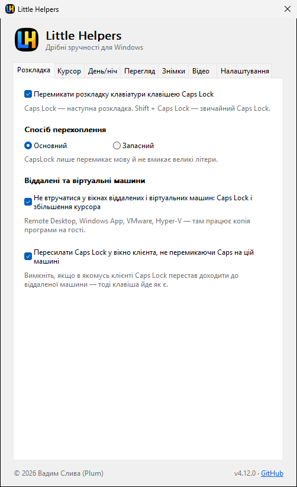
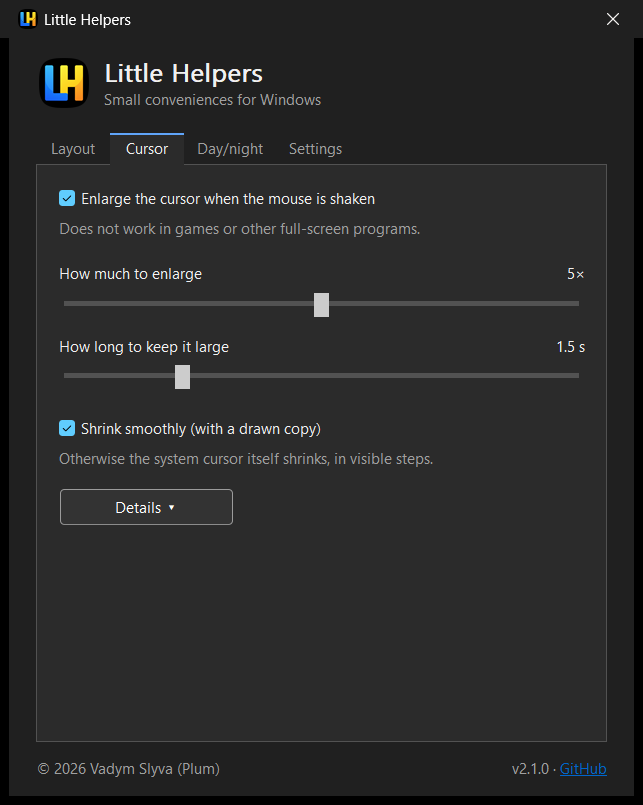
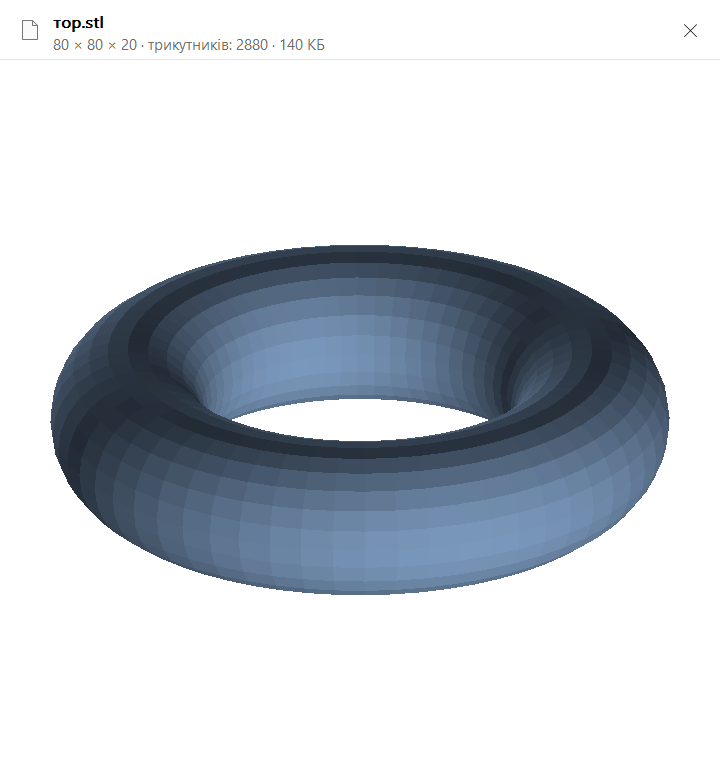
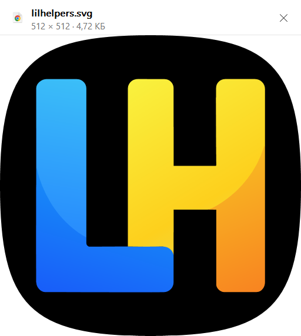
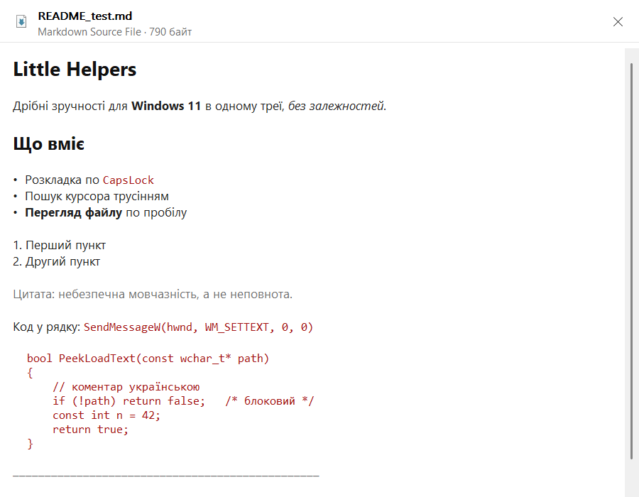
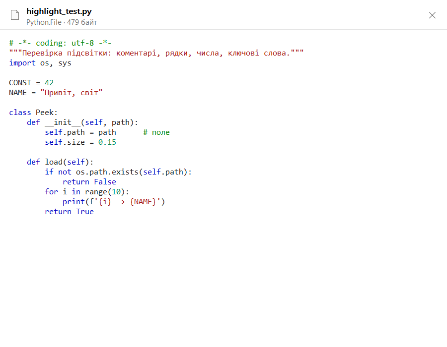
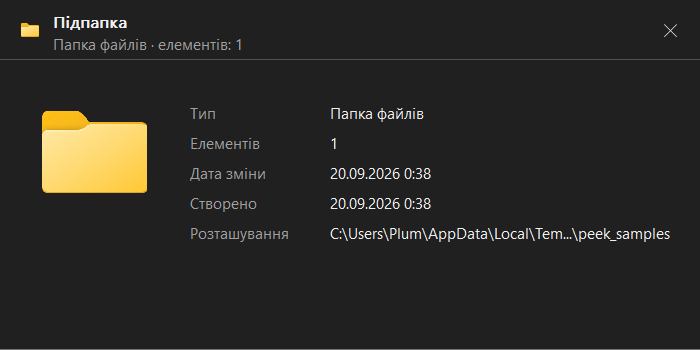

# Little Helpers


Дрібні зручності для Windows 11 в одному треї, без залежностей, один exe:

- **Розкладка** — CapsLock перемикає розкладку клавіатури, Shift + CapsLock —
  звичайний Caps Lock.
- **Курсор** — потрусіть мишею, і курсор на мить стане великим (як на macOS).
- **День/ніч** — світла/темна тема Windows за сходом і заходом сонця або за
  розкладом.
- **Перегляд** — пробіл у Провіднику показує виділений файл, як Quick Look на
  macOS або Peek у PowerToys: зображення (у т. ч. WebP) і SVG, PDF, відео
  кадром, моделі STL, текст, docx і форматований JSON. ⚠ Експериментально,
  з 2.2.0.
- **Знімки екрана** — гаряча клавіша знімає екран, ділянку або зображення з
  буфера, а редактор дає обвести потрібне й віддати результат у буфер або у
  файл. ⚠ Експериментально, з 3.0.0.
- **Запис відео з екрана** — `Alt+Shift+5` записує ділянку, вікно або екран
  у MP4 з тією самою HDR-компенсацією, що й знімки; записи лежать у бібліотеці
  поруч зі знімками. ⚠ Експериментально, з 4.0.0.
- **Темна тема самого вікна**, автооновлення з GitHub Releases з перевіркою
  підпису.
- Інтерфейс **українською та англійською** — за мовою Windows або вручну.

*Little Helpers — small Windows 11 conveniences in one tray app: CapsLock
layout switching, shake-to-find-cursor, automatic light/dark theme by
sunrise/sunset, space-bar file preview in Explorer (experimental),
screenshots with an editor that keeps marks editable (experimental), screen
video recording to MP4 with HDR compensation (experimental), signed in-app
updates. English and Ukrainian UI, picked from
your Windows language or by hand. Single file, no dependencies.*

| Світла тема, українською | Темна тема, англійською |
|---|---|
|  |  |

## Розкладка

Клавішу можна перехоплювати двома способами, перемикач — на вкладці
«Розкладка» (зберігається в `HKCU\Software\lilhelpers`, `Mode`):

- **Основний** — low-level клавіатурний хук, який ковтає CapsLock (`return 1`).
  Єдиний спосіб не дати Caps Lock перемкнутися. Колбек не робить нічого, крім
  `PostMessage` головному вікну: усе важче ризикує не вкластися в
  `LowLevelHooksTimeout`, після чого Windows тихо зніме хук. Сам хук живе на
  **окремому потоці** з власним циклом повідомлень, тож зайнятість UI-потоку
  (наприклад, синхронні COM-виклики планувальника при вмиканні автозапуску)
  не може задушити колбек.
- **Запасний** — `RegisterHotKey(VK_CAPITAL, MOD_NOREPEAT)`. Нічого не
  перехоплює і не дратує захисні програми, але Windows **однаково перемикає
  Caps Lock**: тогл відбувається рівнем нижче, ніж доставка `WM_HOTKEY`.
  Скасувати його ін'єкцією `SendInput` не можна — власну ін'єкцію ковтає
  власна ж реєстрація хоткея (перевірено: `SendInput` повертає успіх,
  `WM_HOTKEY` не приходить, стан не змінюється). Тому це саме запасний режим,
  для випадків, коли хук заблокований або конфліктує.

Далі однаково для обох:

- Перемикання: `WM_INPUTLANGCHANGEREQUEST` (через `PostMessage`, неблокуюче) у
  реально сфокусоване вікно (`GetGUIThreadInfo().hwndFocus` — коректно для UWP).
- Маніфест `requireAdministrator`: без нього UIPI блокує повідомлення у бік
  elevated-вікон (адмінський термінал, regedit) — Caps ковтався б, а розкладка
  не перемикалась. Наслідок: ручний запуск — через UAC-промпт.
- **«Не перехоплювати Caps Lock у вікнах віддалених і віртуальних машин»** —
  Remote Desktop, Windows App, VMware, Hyper-V: хай там перемикає та копія
  програми, що на віддаленій машині.
- **«Перемикати розкладку клавіатури клавішею Caps Lock»** вмикає саме
  перехоплення; вимкнено — Caps Lock звичайний, а програма далі працює заради
  курсора й дня/ночі. Автозапуск — окремо, у «Налаштуваннях».

## Курсор — пошук трусінням

На великому моніторі курсор легко загубити. Потрусіть мишею — він на кілька
секунд стане великим, потім плавно зменшиться до звичайного розміру, щоб око
встигло провести його до кінцевої точки.

- **Збільшуємо сам системний курсор** (`SystemParametersInfo` 0x2029 →
  `CursorBaseSize`), а не малюємо збільшену копію в оверлеї. Причина: апаратний
  курсор Windows малюється поверх усіх вікон, тож копія в оверлеї завжди йшла б
  у парі з живим маленьким курсором. Ціна рішення — це глобальна настройка
  користувача, тому перед збільшенням вихідний розмір лишається слідом у реєстрі
  й відновлюється навіть після аварійного завершення програми.
- **Жест** розпізнається не за швидкістю, а за відношенням пройденого шляху до
  діагоналі габариту руху: прямий кидок через увесь екран дає відношення ≈1,
  трусіння — у рази більше. Рухи із затиснутою кнопкою ігноруються повністю —
  саме вони (ривкова перемотка повзунка, малювання, перетягування вікна)
  найчастіше виглядають як трусіння.
- **У повноекранних програмах не працює**: `SHQueryUserNotificationState` ловить
  exclusive-D3D і презентаційний режим, а borderless-вікна — додаткова перевірка
  (вікно рівно на монітор і без заголовка/рамки; робочий стіл і панель задач
  виключені за класом вікна).
- **Зменшення за замовчуванням малюється копією курсора в layered-вікні**
  («Зменшувати плавно» на вкладці). Системний розмір анімувати неможливо: кожен
  кадр коштує синхронного бродкасту, і на завантаженій машині виходить 2-3
  стрибки замість плавності. Копія ж малюється звичайною композицією — десятки
  кадрів даром. Системний розмір при цьому повертається одним викликом у
  фоновому потоці, а копія прикриває момент перемикання. Плата за це — під
  копією видно справжній курсор (він уже нормального розміру й у тій самій
  точці), тож опцію можна вимкнути.
- Якщо копію вимкнено, зменшується сам системний курсор, і тоді анімація
  **прив'язана до ЧАСУ, а не до кількості кроків**, і крутиться на окремому
  потоці. Причина: кожне застосування розміру шле синхронний `WM_SETTINGCHANGE`
  усім вікнам, і його вартість залежить від того, скільки їх відкрито (виміряно:
  0.1 мс без бродкасту проти ~35 мс із ним на порожньому столі, і помітно
  більше під навантаженням). Розмір обчислюється з того, скільки часу минуло:
  на швидкій системі кадрів більше й анімація гладка, на повільній — менше, але
  тривалість та сама. Проміжні значення округлюються до сходинки Windows (32 px
  + кратне 16), бо між сходинками курсор виглядає однаково, а виклик коштує
  повного бродкасту.
- Налаштування — вкладка **«Курсор»**: увімкнення, наскільки збільшувати (2–8×)
  і скільки тримати (0,5–5 с). Під кнопкою **«Детально»** — пороги жесту: вікно
  розпізнавання (мс), мінімальний шлях миші (px), поріг «шлях / розмах» (%),
  мінімум змін напрямку, плавність зменшення (мс).

Дефолти (1000 px шляху, 350 %, 3 зміни напрямку, вікно 700 мс) підібрані на
симуляції жестів: жоден зі звичайних рухів — кидок через 4K-екран, наведення з
доводкою, тремтіння руки, водіння по меню — не проходить, а справжнє трусіння
зараховується за 4–6 махів (≈0,4 с при амплітуді 250–300 px).

## День/ніч — автоматична світла/темна тема Windows

Вкладка **«День/ніч»** перемикає тему Windows (і застосунків, і системну —
разом, щоб не було мішанини) за сходом/заходом сонця або за розкладом.

- **Механіка**: два DWORD у `HKCU\Software\Microsoft\Windows\CurrentVersion\
  Themes\Personalize` (`AppsUseLightTheme`, `SystemUsesLightTheme`; 0 = темна) і
  бродкаст `WM_SETTINGCHANGE` з `ImmersiveColorSet`, без якого частина вікон не
  перемальовується. Бродкаст іде з окремого потоку, щоб зависле чуже вікно не
  морозило наш UI. Перевірка — раз на хвилину, а також одразу після пробудження
  зі сну та зміни часу/поясу.
- **Схід і захід** рахуються локально за алгоритмом NOAA (точність ~1 хв), без
  мережі. Полярний день/ніч обробляються (світла/темна на всю добу).
- **Розташування** — під кнопкою «Детально», ланцюжок за замовчуванням:
  служба геолокації Windows → за IP-адресою (один GET до `ip-api.com`) → часовий
  пояс і регіон Windows (довгота з UTC-зміщення, широта/довгота країни з
  `GetGeoInfo`; найгрубіше — похибка до години). Або вручну: широта й довгота.
  Останнє визначене розташування кешується в реєстрі, тож після старту тема
  застосовується одразу, а сенсор/мережа опитуються у фоні й не частіше ніж раз
  на добу. Явний вибір «Служба Windows» один раз показує системний діалог
  дозволу; у режимі «Автоматично» діалогів немає. Під VPN визначення за IP
  покаже розташування VPN-сервера.
- **«Переключити зараз»** — ручний вибір, який діє **до наступної межі**
  (наступного сходу/заходу або часу розкладу). Далі автоматика знову рахує
  потрібний стан від розкладу, а не просто фліпає назад.
- **Поки на передньому плані повноекранна програма** (гра, фільм), тема не
  змінюється — перемкнеться, щойно вона закриється (той самий детектор, що й у
  пошуку курсора).
- **Розклад** — один на всі дні: «темна з» і «світла з».

## Перегляд файлу по пробілу ⚠ експериментально

> **Функція ще в розробці, стабільна робота не гарантується.** З'явилась у 2.2.0
> і поки обкатується. Якщо заважає — вимикається чекбоксом на вкладці
> «Перегляд»; тоді пробіл у Провіднику поводиться рівно як раніше.

Пробіл на виділеному файлі в Провіднику або на робочому столі відкриває вікно
перегляду; ще раз пробіл або Esc — закриває. Те саме, що Quick Look на macOS і
Peek у PowerToys, але **без окремого рантайму**: усе нижче намальовано власними
силами або системними API, які вже є у Windows — жодної нової залежності. Разом
уся функція коштує **163 КБ**: 387 КБ у 2.1.1 → 550 КБ у 2.6.0.

| Модель STL | SVG |
|---|---|
|  |  |
| **Markdown зверстаним** | **Код із підсвіткою** |
|  |  |
| **Картка файлу** | |
|  | |

- **Вікно не забирає фокус** (`WS_EX_NOACTIVATE`). Провідник лишається активним,
  стрілки гортають файли як завжди, а перегляд стежить за виділенням і сам
  підхоплює новий файл. Це відрізняється від Peek, який робить власне гортання:
  тут виділення Провідника і те, що на екрані, — завжди одне й те саме.
- **Зображення** (JPEG, PNG, GIF, BMP, TIFF, ICO) — через GDI+, з поворотом за
  EXIF, зменшена копія кешується під розмір вікна; **анімовані GIF програються**,
  кожен кадр зі своєю затримкою. **WebP** (а також HEIC, AVIF, JXR, якщо в
  системі є їхні кодеки) — через WIC, бо GDI+ їх не знає. Це декодер
  зображення, а не обробник прев'ю: без інтерфейсу користувача й скриптів, із
  вузьким контрактом, — межу щодо чужого COM проведено саме тут.
- **PDF** — усі сторінки, через вбудований `Windows.Data.Pdf`. Гортається
  коліщатком над вікном або стрілками `‹ ›` у шапці; показувати лише першу
  сторінку сенсу мало. Документ лишається завантаженим на тому ж потоці, поки
  відкритий перегляд, тож гортання коштує лише рендеру сторінки — переоткривати
  файл щоразу було б помітно повільно на сорокасторінковій інструкції. Клавіші
  навмисно не чіпаємо: стрілки в Провіднику й далі гортають **файли**, а
  коліщатко Windows шле вікну під курсором і без фокуса — саме тому це працює. Це сама
  Windows, а не зареєстрований кимось обробник, тож правило про чужий COM
  лишається цілим. Заголовка для цього API немає ні в MinGW, ні без Windows
  SDK, тому інтерфейси оголошені вручну; IID фабрики не вгадано, а отримано
  від неї ж через `IInspectable::GetIids()`, і порядок методів перевірено
  живими викликами. ⚠ Уся робота йде на **окремому потоці з апартаментом MTA**:
  у STA (а UI-потік саме такий) асинхронна операція WinRT не завершується, поки
  потік не прокачує чергу повідомлень — без цього `LoadFromStreamAsync` стабільно
  віддає `E_FAIL`. Прокачувати чергу всередині обробника повідомлення означало б
  реентрантність інтерфейсу, що гірше за окремий потік.
- **Текст і код** до 1 МБ — з визначенням кодування: BOM, далі сувора перевірка
  UTF-8, далі UTF-16LE (видає себе NUL-ами в непарних байтах), і лише для
  відомих текстових розширень — системне ANSI.
- **Markdown показується зверстаним**, а код — **з підсвіткою синтаксису**.
  Обидва робить один механізм: текст перетворюється на RTF і вливається в
  RichEdit одним потоком (`EM_STREAMIN`). Тисячі `EM_SETCHARFORMAT` на файлі в
  кількасот кілобайт помітно гальмують, RTF — ні. Підсвітка свідомо **одна на
  всі мови**: коментарі, рядки, числа й спільний набір ключових слів, а стиль
  коментарів береться за розширенням. Повноцінні граматики на кожну мову — це
  вже інший застосунок; для перегляду цього досить. Понад 400 КБ підсвітка
  вимикається: користь мала, а пауза помітна.
- **Масштабування** для всього, що показується картинкою — зображень, SVG, STL,
  сторінок PDF. Коліщатко збільшує **навколо курсора** (щоб «наблизити оце» не
  перетворювалось на «наблизити й шукати, куди воно поїхало»), перетягування
  рухає, подвійний клік вписує назад. У багатосторінковому PDF просте коліщатко
  гортає сторінки, а масштабує `Ctrl` + коліщатко.
- **JSON переформатовується** перед показом: стиснений файл інакше суцільна
  стіна тексту. Це навмисно не парсер — валідність не перевіряється, вміст
  рядків не чіпається, переписуються лише пробіли поза рядковими літералами.
  Файл із розбалансованими дужками показується як є, а не калічиться; те саме
  з JSON, обрізаним стелею в 1 МБ. Підпис каже «відформатовано», щоб вигляд не
  сплутали з самим файлом.
- **Відео** (mp4, mov, avi, wmv, mkv…) — перший кадр, роздільність і тривалість
  через Media Foundation. Саме кадр, а не відтворення: програвання означало б
  власний рендер, звук і керування, тобто іншу задачу. Два місця, де це легко
  зробити неправильно: без `MF_SOURCE_READER_ENABLE_VIDEO_PROCESSING` читач не
  віддає RGB32 для більшості кодеків, а найперший кадр у багатьох файлах чорний
  — тому перед читанням трохи відмотуємо. Перевірено на 4K-зйомці з дрона по
  мережевій теці: кадр зі 101 МБ приблизно за 1,7 с.
- **Моделі STL** (двійкові й текстові) — власний растеризатор: z-буфер, плоске
  затінення, нуль залежностей. Двійковий чи текстовий визначається **розміром
  файлу**, а не словом `solid` на початку — купа експортерів пише `solid` і в
  двійковий файл. Нормалі з файлу ігноруються на користь порахованих із вершин
  (у реальних STL вони часто нульові або дивляться не туди), а освітлення
  двостороннє, бо намотка трикутників теж буває неузгодженою. У підписі —
  габарити, які для друку зазвичай і є причиною відкрити файл.
- **Документи Word** (docx) — текстом. Пакет читає системний Packaging API
  (`msopc`), тож власний розпакувальник zip не знадобився. Верстку відтворити
  без рушія Word неможливо, а текст відповідає на питання «що це за документ».
- **Решта файлів і папки** — картка: значок, тип, розмір, дати, розташування,
  для папки ще й кількість елементів. Картка росте під вміст.
- **STEP** (`.step`, `.stp`) — картка з шапки файлу: автор, організація, дата,
  схема, приблизна кількість сутностей. Геометрію ми не малюємо і не вдаємо, що
  можемо: це B-rep з NURBS-поверхнями, для якого потрібен рушій штибу
  OpenCASCADE — десятки мегабайтів, тобто рівно те, чого цей застосунок уникає.
- **Що лишається за Провідником.** Пробіл там має рідні функції, тож фіча
  свідомо не жадібна: Ctrl/Shift/Alt/Win + пробіл, пошук набором літер (пробіл
  протягом секунди після літери), пробіл у полях адреси, пошуку й
  перейменування, у дереві тек і в діалогах відкриття/збереження. Хук ковтає
  пробіл, лише коли фокус саме у списку файлів (`DirectUIHWND` або
  `SysListView32` усередині `SHELLDLL_DefView`). Якщо виділення порожнє, пробіл
  повертається Провіднику через `SendInput` з власною міткою в `dwExtraInfo`,
  яку хук пропускає, — рідна поведінка не губиться.
- **Файл зображення читається в пам'ять** (до 64 МБ) і декодується з потоку, а не
  з файлу: інакше перегляд тримав би файл відкритим, і перейменувати чи видалити
  його було б не можна. Це ж дає анімацію — `Clone()`, яким раніше знімався
  замок, схлопував багатокадровий GIF в один кадр.
- **Виділення читається як `CF_HDROP`** з `IDataObject` вигляду теки
  (`IShellWindows` → `IShellBrowser` → `IShellView`). Зручніший `IFolderView2`
  тут не працює: це проксі до об'єкта в `explorer.exe`, а проксі-стаба для
  цього інтерфейсу немає — `QueryInterface` мовчки віддає `E_NOINTERFACE`.
  Вкладки Провідника у Windows 11 — окремі записи з тим самим HWND вікна, тому
  вигляд звіряється за вікном самого вигляду, а не за верхнім вікном.
- **Ярлики показують, КУДИ ведуть**, а не власні нутрощі: `.url` читається як
  ini, `.lnk` — через `IShellLink` без `Resolve` (той ходить у мережу й може
  надовго зависнути на недоступному диску). Інакше ярлик гри Steam показував би
  свій текст, бо `.url` формально є текстовим файлом.
- **SVG малюється системним Direct2D** (`ID2D1DeviceContext5::CreateSvgDocument`)
  — це сама Windows, а не зареєстрований кимось обробник, тож правило про чужий
  COM в елевейтованому процесі не порушено. Пробою з'ясовано межі: шляхи,
  градієнти, `clipPath`, обведення й прозорість груп він тягне, а `<text>`,
  `<mask>`, `<filter>` і `<pattern>` **мовчки ігнорує**. Мовчки — найгірше, бо
  картинка виходить неправильною, і побачити це нізвідки; тому файли з цими
  елементами малюються, але підпис чесно каже, чого бракує («без ефектів»,
  «без маски», «без тексту»). Спершу я відмовлявся малювати такі файли зовсім —
  перевірка на двох справжніх іконках показала, що це надто категорично: без
  `<filter>` зникає лише тінь, без `<mask>` — лише відблиск, а зображення
  лишається впізнаваним. Небезпечне тут **мовчання**, а не сама неповнота. Якщо ж
  рендер вийшов практично порожнім, повертаємось до розмітки — і перевіряється це
  за **вмістом** бітмапа, а не за списком елементів, тож ловляться й ті випадки,
  про які ми не здогадались.
  Препас лікує чотири місця, де реальні файли ламають Direct2D. Illustrator
  задає заливки CSS-класами в `<style>` (без препасу власна іконка проєкту
  виходила суцільною **чорною плямою**). `<use href>` з SVG 2 Direct2D не бачить
  — впізнає лише старий `xlink:href`. Далі: Direct2D **шанує `width`/`height`
  кореня** і малює документ саме в тому розмірі, ігноруючи полотно, яке ми
  дали, — через це іконка 24×24 виходила крапкою, а креслення з розміром «724mm»
  узагалі порожнім; коли є `viewBox`, ці атрибути прибираються. І нарешті
  креслення для лазера приходять зі штрихом у частках міліметра: при `viewBox`
  724 штрих 0.15 тонший за піксель і просто зникає, тож субпіксельні штрихи
  піднімаються до помітних.
- **Системні обробники прев'ю (`IPreviewHandler`) свідомо НЕ використовуються.**
  Вони дали б PDF і Office майже задарма, але означали б завантаження чужого
  COM-коду в наш процес, що працює з правами адміністратора. Windows саме тому
  виконує їх в непривілейованому `prevhost.exe`. Якщо PDF колись знадобиться —
  це окремий неелевейтований процес-помічник, а не виняток тут. З тієї ж
  причини значки й назви типів беруться за розширенням
  (`SHGFI_USEFILEATTRIBUTES`), без виклику обробників конкретного файлу.
- Вимикається чекбоксом на вкладці **«Перегляд»** (`Peek` у реєстрі). Клавіатурний
  хук спільний з розкладкою: він тримається, поки потрібен хоч одній із фіч.

## Редактор знімків ⚠ експериментально

З 3.0.0. Гаряча клавіша робить знімок, відкривається редактор, а результат іде
в буфер обміну або у файл.

| Клавіша | Що робить |
|---|---|
| `Ctrl+Alt+4` | взяти зображення з буфера обміну |
| `Alt+Shift+4` | обвести ділянку, клікнути вікно або `Space` — увесь екран; куди далі — вирішує жест |
| `Alt+Shift+3` | зняти екран цілком — з дією «без клавіші» |
| `Ctrl+Alt+E` | відкрити порожній редактор — без знімка |

Клавіші змінюються на вкладці «Знімки»: клацніть поле й натисніть свою
комбінацію. Якщо її вже тримає інша програма, поле скаже про це в ту саму
секунду, а не тоді, коли клавіша мовчки не спрацює.

Прапорець «Захоплювати знімки гарячими клавішами» вгорі вкладки вимикає всю
функцію разом (з 4.0.0): клавіші **звільняються** — їх може взяти інша
програма, — а пункти знімків у треї сіріють. Самі комбінації лишаються в
налаштуваннях і повертаються, щойно прапорець увімкнуть знову.

**Порожній вхід.** Редактор відкривається і без знімка — прозорим полотном
1280 × 800, на яке можна вставити картинку з буфера, з якого відкрити
бібліотеку чи імпортувати файл. Три двері: пункт трея «Знімки → Редактор
знімків», гаряча клавіша `Ctrl+Alt+E` і ключ командного рядка `--editor`
(другий екземпляр передає команду першому й виходить). Поки полотно ще
порожнє, `Ctrl+V` кладе картинку **на полотно** — замінює підкладку; щойно
на ньому щось є, `Ctrl+V` знову вставляє окремим об'єктом. Уже відкритий
редактор будь-який із входів лише піднімає. Полотно без вмісту й смуга
властивостей без позначок підказують, з чого почати, — порожня смуга
читалась як поломка.

Ярлик на робочому столі: `lilhelpers.exe --editor` працює, але exe вимагає
прав адміністратора, тож перед передачею команди Windows покаже UAC. Без
UAC — ярлик на `cmd.exe /c "set __COMPAT_LAYER=RunAsInvoker && start "" "C:\шлях\lilhelpers.exe" --editor"`
(«Виконувати: згорнуте»): другий екземпляр стартує без підвищення і лише
передає команду — головне вікно навмисно приймає це повідомлення знизу
вгору (UIPI), як і перетягування файлів.

**Чому не `BitBlt`.** У режимі HDR робочий стіл композиційно лежить у scRGB
або PQ, і звичайний захват віддає той буфер **без тон-мапінгу** — звідси
вицвілі або темні знімки. Полагодити це потім неможливо: оригінал уже
втрачено. Тому захват іде через Desktop Duplication, яка разом із пікселями
віддає й колірний простір виходу, і експозиція виправляється один раз, на
вході. Редактор при цьому лишається 8-бітним.

**Позначка — не мазок у пікселях, а об'єкт зі списку.** Колір, товщину й
прозорість прямокутника можна змінити хоч через годину після того, як його
намальовано, а скасування й повтор виходять із цього самі собою.

**Вибір ділянки спершу заморожує екран** і лише потім показує рамку поверх
замороженого кадру. Через це притемнення й сама рамка не потрапляють у
результат, а вибір точний до пікселя.

**Що знімаю вирішує накладка, куди віддаю — жест.** У тій самій накладці
тягнеш — ділянка; клік без тягання — вікно під курсором (його підсвічено ще до
кліку); клік по робочому столу або `Space` — увесь монітор. Жест у мить
відпускання обирає дію:

| Жест | Типово |
|---|---|
| без клавіші | відкрити в редакторі |
| `Shift` | скопіювати в буфер — редактор не відкривається, біля курсора на мить «Скопійовано» |
| `Alt` | редагувати просто тут, в оверлеї |

Підказка про `Shift` і `Alt` стоїть поруч із координатами й розміром, і дія
затиснутого модифікатора в ній світиться. Призначення змінюється на вкладці
«Знімки» матрицею «жест × дія»: вибір дії, зайнятої іншим жестом, міняє їх
місцями, тож кожна дія завжди досяжна рівно одним жестом. Там же — чи класти
в бібліотеку й знімки без редактора (типово так; запис іде після того, як
картинка вже в буфері, тож вставка не чекає).

**Оверлей** — той самий редактор поверх замороженого монітора, без вікна.
Рейка інструментів стоїть ліворуч від рамки, смуга властивостей — над нею;
якщо місця немає, вони переходять на протилежну грань, а коли й там ні —
усередину рамки. Рядка стану й правої панелі немає; кадрування теж — ним є
сама рамка, і її можна підправляти ручками навіть після того, як почав
малювати (`Ctrl+Z` повертає й рамку). Унизу рейки — **«У вікно редактора»**,
яка переносить знімок разом із позначками в повне вікно з тоном, розміром,
бібліотекою й експортом, а під нею, найнижче, **«Копіювати»** (і `Enter`, і
`Ctrl+C`: скопіювати й закрити) — там само, де й у вікні (CAPS-70). `Ctrl+S` — зберегти в бібліотеку й закрити. `Esc` знімає шари, як
у вікні, а останній — за налаштуванням: просто закрити (типово) або, якщо є
позначки, спершу зберегти в бібліотеку.

**Плавність на 4K.** Накладка вибору й оверлей не малюють заморожений кадр
заново на кожен рух миші: при відкритті він один раз складається у два шари в
пам'яті — світлий і притемнений, — а кадр складається з їхніх копій. Далі
перемальовується лише змінене: напрямні, плашка, край і різниця рамки, а в
оверлеї — ділянка навколо позначки, яку малюють чи тягнуть (якщо на знімку є
розмиття чи пікселізація, кадр лишається повним: вони залежать від усього під
ними). Буфер кадру живе разом із вікном. У вікні редактора масштабований знімок
(бікубічно, з шахівницею) кешується й перебудовується лише при зміні масштабу,
прокрутки, розміру вікна чи самого знімка, а тягнення позначок так само
перемальовує лише ділянку навколо них. На 4K кадр накладки — з 134 до 5–6 мс,
оверлея — з 123 до 4–5 мс, розгорнутого вікна з 4K-знімком — з ~570 до ~10 мс;
тестовий харнес перевіряє, що частково перемальований кадр і кешований вигляд
піксель у піксель збігаються з повним некешованим.

Результат оверлея побайтово збігається з тим, що дав би шлях через вікно, —
не за збігом, а за побудовою: перед будь-яким виходом документ вирізається
рамкою тією самою функцією, що й у вікні, а позначки зсуваються на її
початок. Харнес перевіряє це на справжньому кадрі з розмиттям біля самого
краю рамки.

**У буфер кладуться три формати одразу** — PNG, `CF_DIB` і `CF_BITMAP`, — бо
жоден із них поодинці не приймається скрізь. У файл іде PNG або JPEG, і завжди
в розмірі оригіналу, а не в розмірі вікна.

Редактор — і у вікні, і в оверлеї — відкривається одразу з **прямокутником**
(CAPS-66): на свіжому знімку вибирати нічого, а прямокутник потрібен найчастіше.
Збережений документ із позначками відкривається на «Виборі» — його відкривають,
щоб поправити намальоване. Перший `Esc` при цьому поводиться як раніше: закриває
(або знімає вибір), а не перемикає прямокутник на «Вибір».

Інструменти: прямокутник, еліпс, лінія, олівець, текст, приховування,
маркер, лічильник, штамп. Для кожного — колір, три товщини й прозорість, для замкнених фігур ще
й заливка окремим кольором. `Shift`
тримає квадрат, коло й кут, кратний 45°. Інструмент лишається активним після
малювання, щоб поставити кілька позначок поспіль; перемикається на вкладці
«Знімки».

**Колір — кнопкою-зразком із випадною палітрою** (CAPS-41, CAPS-49). Вісім
зразків у рядок більше не з'їдають смугу: там стоїть одна кнопка з поточним
кольором, за нею — палітра з назвою, вісьмома кольорами й власним повзунком
прозорості. Зразки скрізь — квадратики, як і клітинки палітри (CAPS-66), а
наповнення каже, що це за колір: **квадратна рамка** — контур (лінія, олівець,
рамка фігури, обводка напису), **суцільний квадратик** — заливка чи колір самої
позначки (літери, штамп, маркер). Порядок однаковий у всіх: ліворуч рамка,
праворуч суцільний — тож у напису ліворуч обводка, праворуч колір літер
(CAPS-67). Лічильник має власний вигляд кнопок — квадратик із цифрою.

Напис і маркер **пам'ятають свої кольори окремо** від решти інструментів: зміна
кольору прямокутника не перефарбовує наступний напис, і навпаки. Напівпрозорий колір лежить на
шахівниці, тож прозорість видно, не розкриваючи палітри. Вибір кольору закриває
палітру; повзунок — ні.

Поруч стоїть **друга кнопка** — другий колір, у кожного виду свій:

| Позначка | Друга кнопка | «Немає» / «Авто» | Своя прозорість |
|---|---|---|---|
| прямокутник, еліпс | **Заливка** | без заливки | так |
| напис | **Обводка** | без обводки | так (відносно літер) |
| лічильник | **Цифра** | «Авто» — чорна чи біла за контрастом | ні: цифра — частина кружечка |

У прямокутника й еліпса заливка й контур незалежні: напівпрозорий жовтий
усередині й непрозорий червоний контур — звичайна справа. «Немає» є і в контуру —
тоді це суцільна плашка, якою була колишня «Заливка»; прибрати обидва одразу не
дасть сама палітра (фігура зникла б). Кольори контуру, заливки, обводки й цифри
запам'ятовуються окремо й дістаються наступній позначці того ж виду. У
зображення, емодзі, розмиття й пікселів кольору немає — там у смузі лише кнопка
**«Прозорість»**.

Між двома кнопками кольору — **перемикач ⇄** (`X`): кольори міняються місцями
разом із прозорістю. «Контур без заливки» стає «заливкою без контуру» одним
кліком, «біле з чорною обводкою» — «чорним з білою», кружечок лічильника
міняється кольором із цифрою («Авто» спершу стає тим кольором, який видно). У
напису без обводки перемикач неактивний: літер «немає» не буває.

**Товщина** (висота маркера, розмір кружечка й штампа) — теж кнопкою-списком.
Значок — три товщини поруч, поточна темна; клавіші **`[`** і **`]`** — тонше й
товще. Коли контур фігури вимкнено, значок блідне: товщина ні на що не впливає.

**Смуга без рамок** (CAPS-65): кнопки в спокої — без рамки й тла, при наведенні
— легка підкладка, вибране й відкрите — підкладка акцентом. Групи розділяють
тонкі вертикальні риски. Стрілка списку лишилась, але менша й бліда: без рамки
лише вона каже «клік відкриє список».

Клавіатура йде за місцем кнопки: **`1`–`8`** — колір лівої кнопки (контур,
обводка напису), **`Shift+1`–`8`** — правої (заливка, колір літер, цифра);
**`0`** і **`Shift+0`** — «Немає» в лівій чи правій. Документи,
збережені до 3.33, відкриваються як були: стара «Заливка» стає фігурою без
контуру, світла й темна обводки — білою й чорною.

**Стиль лінії й наконечники** — у випадних селектах смуги: кнопка показує
поточний вибір, за нею решта варіантів. Контурні фігури можуть бути суцільними,
пунктирними чи штрихпунктирними.

Окремої «стрілки» немає — **наконечники це властивість лінії**, і передній із
заднім задаються НЕЗАЛЕЖНО: кожен окремо буває трикутником, «пташкою»,
кружечком або взагалі відсутнім. Тож одна й та сама лінія стає стрілкою в один
бік, двосторонньою стрілкою чи просто відрізком, і з різними наконечниками на
кінцях. Розмір спільний і заданий у пікселях знімка, а не в товщинах пера, тож
великий наконечник лишається великим і на тонкій лінії.

У смузі лінії дві кнопки: **«Стиль»** і **«Кінці»** (CAPS-64). «Кінці» малює
всю лінію з обома кінцями так, як вона ляже на знімок, а «без наконечника» — як
маленьку риску-упор: так кнопки не зливаються, а стан видно без розкриття.
Панель «Кінці» — три рядки з підписами: «Початок», «Кінець», «Розмір»; вона
лишається відкритою, поки клацаєш у ній, бо зазвичай ставлять і початок, і
кінець.

**Кути прямокутника й вставленого зображення** (CAPS-58) — випадна кнопка
«Кути»: без скруглення, помірне, сильне. Радіус — у пікселях знімка, помножених
на масштаб монітора, з якого знято: на 4K при 150 % помірне скруглення виглядає
так само, як на 1080p. Масштаб зберігається в документі, тож після відкриття кути
лишаються тими самими. Радіус обмежено половиною коротшої сторони — вузька рамка
не стає пігулкою. Вибір для прямокутника стає типовим для наступних; вибір для
зображення — ні. Плашку приховування не скруглено: там кути довелося б вирізати
разом із пікселями знімка.

**Напис читається на будь-якому тлі.** Текст малює DirectWrite, а не GDI+, і в
нього є обводка будь-якого кольору з палітри (типово біла). Червоне на темному
скриншоті без обводки не видно взагалі; з білою — видно скрізь. Ще є кегль, жирний, курсив і
вирівнювання. Набирається у звичайному полі просто на знімку: `Enter` — готово,
`Shift+Enter` — новий рядок, `Esc` — скасувати. Подвійний клік по напису
відкриває його на правку хоч через годину.

**`Shift` під час зміни розміру тримає пропорції.** Кутова ручка веде обидві
сторони за тією, що змінилася сильніше; бічна тягне свою вісь, а друга росте від
свого центра. У лінії «пропорція» — це кут: `Shift` тримає ті самі вісім осей
через 45°, що й під час малювання. Те саме працює і на спільній рамці кількох
вибраних.

Ручки з боків напису міняють **ширину блока**: розтягніть його — і рядки почнуть
переноситись, а вирівнювання по центру чи праворуч нарешті матиме сенс. Висота
завжди виходить із самого тексту, розмір літер задає кегль.

**Приховати ділянку** (`B`) — те, заради чого скріншот найчастіше й правлять:
прибрати з нього токен, адресу або чуже прізвище. Три режими в одному
інструменті: розмиття, пікселі й суцільна плашка, з повзунком сили.

⚠ **Гарантовано незворотна лише плашка.** Пікселізація замінює блок його
середнім — відновити з нього оригінал неможливо, тому при типовій силі вона теж
надійна. А от розмиття в принципі оборотне: достатньо сильний зворотний фільтр
частково витягує те, що під ним. Якщо ховаєте щось справді таємне — беріть
плашку або пікселі, а розмиття лишайте для косметики.

**Маркер** (`H`) тягнеться вздовж рядка й множиться на фон, а не лягає зверху:
текст під жовтою смугою лишається чорним і читабельним. Чотири кольори, три
висоти смуги.

**Обидва ефекти бачать усе, що під ними за порядком** — не лише сам знімок, а й
позначки, намальовані раніше, вкинуті зображення й полотно, перетворене на
об'єкт. Маркер множиться на те, що під ним справді лежить, а приховування
розмиває або пікселізує саме ті пікселі, які видно на екрані. Що лежить ВИЩЕ за
ефект, він не чіпає — це і є спосіб домалювати стрілку поверх розмитого місця.

Приховане місце лишається звичайною позначкою: його можна пересунути чи змінити
хоч через годину. Незворотним воно стає лише у збереженому файлі або в буфері.

**Лічильник** (`N`) ставить нумеровані кружечки й сам додає одиницю. Номер не
зберігається в кружечку, а рахується з порядку: видалили перший — решта зсунулась,
змінили число початку — перенумерувалась уся група, відкрили інший знімок —
нумерація сама почалася спочатку. Груп може бути кілька, кожна зі своєю
нумерацією: кнопка «нова група» в кінці смуги починає ще одну, а клік по
будь-якому кружечку старої повертає до неї. У смузі властивостей видно, у якій
ви групі, з якого числа вона починається і який номер піде наступним.

**Форма лічильника** (CAPS-68) — список у смузі: кружок, скруглений
прямокутник або «шпилька» — крапелька з хвостиком. Шпилька ставиться вістрям
у точку кліку, а ручкою повороту її можна направити будь-куди; повертається лише
форма, цифра лишається рівною (так само в прямокутника).

Групу можна правити цілою: тогл перед кольором вмикає режим, у якому колір, форма,
колір цифри, розмір і прозорість ідуть усім кружечкам групи, а подвійний клік по
кольору в палітрі чи по розміру робить те саме разово, не вмикаючи режиму. «Мінус у кружечку» в кінці
смуги прибирає всю групу — одним кроком, тож і одним `Ctrl+Z`.

**Штампи** (`S`) — шість власних контурів (галочка, хрестик, знак питання, знак
оклику, зірочка, трикутник уваги) і емодзі. Контури беруть колір із палітри й
масштабуються без втрат. Емодзі мають власний колір, тому палітри в них немає — лише «Прозорість»;
чотири найчастіші стоять просто в смузі, решта — за кнопкою «…».

**Кадр** (`C`) обрізає знімок, не чіпаючи його. За межами кадру видно
затемнення, всередині — лінії третин; пропорції Вільно, 16:9, 4:3 або 1:1.
Підтвердження стоїть на самому кадрі, поруч із розміром у пікселях оригіналу,
а доки ви не підтвердили — «Відкрити», «Копіювати» і «Зберегти» мовчать.

Кроп — властивість кадру, а не операція над пікселями: позначки за його межами
нікуди не діваються, у рядку стану видно, скільки їх зараз поза кадром, і
«Скинути кадр» повертає все на місце хоч через десяток інших дій.

**Дублювати** вибрану позначку — кнопкою біля видалення або `Ctrl+D`.

**Бібліотека** відкривається кнопкою «Відкрити» просто поверх полотна — у тому
самому вікні, з тією ж рейкою й рядком стану; кнопка «назад» і `Esc` повертають
до знімка. Сітка карток по чотири, спочатку нові: мініатюра, назва, час, розмір
і кількість позначок. Праворуч — вибраний знімок крупно, факти й дії:
**«Відкрити»** (`Enter`, подвійний клік), **«Показати в Провіднику»**,
**«Видалити»** (`Delete` — у кошик, `Shift+Delete` — назавжди; підтвердження
на місці кнопок, без окремого вікна). `F2` або олівець перейменовують просто в
картці; назва живе всередині файлу, а ім'я файлу лишається датою й часом. Той
знімок, що зараз на полотні, позначено «у редакторі», і «Відкрити» його просто
повертає до редактора. Мініатюра пишеться у сам файл при збереженні (блок
`THMB`), тож бібліотека не читає повних знімків і окремих файлів не плодить.
Без групування по днях і без пошуку — за рішенням власника, поки не знадобляться.

Скільки тримати — на вкладці «Знімки» в налаштуваннях: **або** «останні N»
(типово 100), **або** «не більше N МБ». Найстаріші йдуть у кошик, коли
зберігається новий; той, що відкритий, не чіпається ніколи. Там же — «Показати
теку» й «Очистити…».

**Три головні кнопки, і кожна робить головне одразу** (CAPS-70). Ліворуч у
рядку стану поруч стоять **«Відкрити»** і **«Зберегти»** — обидві про файли.
«Відкрити» відкриває бібліотеку своїх знімків; у її списку — «Імпорт…»
(чужа картинка з файлу), «З буфера обміну», «Знімок ділянки».
**«Зберегти»** (`Ctrl+S`) кладе знімок **разом із позначками** у бібліотеку —
теку в `%LOCALAPPDATA%\Little Helpers\Library`; у її списку — «Експорт…»
(`Ctrl+Shift+S`, PNG чи JPG для тих, кому потрібна просто картинка) і
«Зберегти як…» (власний формат у будь-яку теку; далі `Ctrl+S` пише саме туди).
**«Копіювати»** (`Ctrl+C`) — квадратна кнопка в самому низу лівої рейки, рівно
там, де вона і в оверлеї: рука йде в те саме місце, хоч би де правили знімок.
Коли вікно низьке, кнопки інструментів трохи стискаються, а «Копіювати»
лишається внизу. Після вдалого
збереження чи копіювання іконка кнопки на секунду стає **галочкою**: напис
посеред рядка стану після натискання в полі зору не був.

Це не картинка: у файлі живуть оригінал, усі позначки з їхніми параметрами,
кадр, тон і геометрія, вкладені зображення й нумерація лічильників. Відкрив — і
далі рухаєш ту саму стрілку. Повторне натискання **перезаписує** той самий
запис, а не плодить копії; новий знімок починає новий запис.

Формат **версіонований від першого файлу** і влаштований так, щоб старі знімки
читалися завжди: файл — це послідовність блоків із тегами, невідомий блок чи
поле читач пропускає. Тип позначки записаний **текстовим тегом**, а не номером:
коли з програми прибрали окрему стрілку, порядкові номери зсунулись і еліпс
мовчки взяв чужу підказку — з номерами у файлі так само тихо переплуталися б
типи в усіх раніше збережених знімках. Таблицю тегів стереже `static_assert`:
новий вид позначки не дасть зібрати програму, поки його не внесли у формат.

Закриваєте редактор із незбереженими змінами — він питає, зберегти чи ні.

**«Імпорт…»** (`Ctrl+O`) зі списку біля «Відкрити» бере зображення з файлу — PNG, JPEG, BMP,
GIF, TIFF, WebP, а також HEIC і AVIF, якщо в системі стоять їхні кодеки, — і
свої власні знімки `.lhshot`, які впізнаються за вмістом, а не за розширенням.
Список поруч —
із буфера обміну або зі свіжого знімка ділянки. Масштаб перегляду там-таки:
повзунок, поточний відсоток і кнопка «100 %», яка показує знімок піксель у піксель.

**Розмір зображення й розмір полотна** — два діалоги в правій панелі, над
тоном. Ширину й висоту можна задати і в пікселях, і у відсотках — **відсоток
свій у кожної осі**, бо з вимкненими пропорціями «70 % завширшки й 100 %
заввишки» одним полем не набрати. Зміна розміру зображення веде позначки за собою координатами, але
товщина ліній, кружечки й штампи лишаються свого розміру: інакше кегль 18 після
зменшення вдвічі став би дев'яткою, якої немає в наборі. Текст масштабується
окремим прапорцем. Коли більшає полотно, наявний знімок **стає окремим
об'єктом** — але тільки якщо в тлі справді щось є: друге й наступне збільшення
просто міняє розмір полотна й порожніх «зображень» більше не плодить. Тло
навколо лишається прозорим — його можна залишити так або підкласти прямокутник
потрібного кольору. Обидві дії — один крок `Ctrl+Z`, разом із пікселями.

**Краї полотна видно завжди**, а прозоре тло під знімком залито ледь помітною
біло-сірою шахівницею: після збільшення полотна одразу зрозуміло, де воно
закінчується і що позначка виїхала за його межі. Прапорець «Тримати пропорції»
в діалогах розміру памʼятає, що ви його вимкнули. Обидва діалоги мають темну
тему разом із рештою вікна.

**Кілька позначок разом.** `Shift`+клік додає позначку до вибору й прибирає з
нього. Коли вибрано більше однієї, смуга властивостей стає іншою: у ній лише
дії над кількома — вирівняти за краями чи центрами, розкласти рівними
проміжками, згрупувати. Клік по будь-якому учаснику групи вибирає всю групу;
рухаються, видаляються й повертаються вони теж разом, одним кроком `Ctrl+Z`.

Габаритний прямокутник у такого вибору **спільний**, і ручки на ньому теж
спільні: кутові й бічні розтягують усіх одразу, кругла ручка над верхнім краєм
повертає їх навколо центра рамки. Напис, лічильник і штамп при розтягуванні
переїздять центром, але лишаються свого розміру — інакше кегль і кружечки
поїхали б у величини, яких у наборі немає.

**Позначку можна повернути** — кругла ручка над верхнім краєм, `Shift` тримає
крок 15°. Повертається все, крім приховування й маркера: ті беруть пікселі
знімка під собою. Повернута позначка ловиться кліком саме по собі, а не по
невидимій прямій рамці, і поворот усього знімка додає їй свої 90°.

**Кадрування саме вписує знімок у вікно**: кадрувати наосліп, коли половина
рамки за краєм, неможливо.

**Вкинуте у вікно зображення стає позначкою** — його можна пересунути, змінити
розмір, зробити напівпрозорим і скасувати, як будь-яку іншу. `Ctrl+V` вставляє
так само, а кнопка **«Зображення»** на рейці (`I`, CAPS-69) — з файлу: вона є й
в оверлеї, куди файл не перетягнеш, і кладе картинку в центр рамки; заміна всього знімка лишилась окремим пунктом у списку біля
«Відкрити». Зображення, більше за сам знімок, зменшується, щоб уміститися.

**Стрілки клавіатури** рухають вибрану позначку на піксель знімка, а з `Shift` —
на десять. Ціла серія натискань лягає в один крок `Ctrl+Z`, а не в двадцять.

**Збільшене полотно прокручується коліщатком** — вертикальним, а вбік
горизонтальним, `Ctrl` + коліщатко або `Shift` + коліщатко. Масштаб змінює
`Alt` + коліщатко (і повзунок унизу): спроба докрутити до краю не має міняти
масштаб. Полотно так само можна тягнути середньою кнопкою або `Пробілом`. На час знімка редактор ховається, щоб не
потрапити у власний кадр.

**Права панель — про сам знімок, а не про позначки.** Звідки він, якого розміру,
скільки на ньому позначок і чи був HDR. Там же поворот на 90° в обидва боки й
дзеркало по горизонталі й вертикалі: пікселі й позначки їдуть разом, тож стрілка
лишається на тому, на що показувала.

**Тон** — експозиція (−2…+2 EV), гама (0,50…2,00) і контраст (−50…+50). Це
паліатив, і чесно ним лишається: він не повертає втраченого, а лише витягує те,
що ще є в 8 бітах — потрібен там, де автоматичне зведення HDR не допомогло або
оригіналу вже нема, бо чужа програма поклала в буфер готову картинку. Оригінал
при цьому не чіпається: тон — рецепт поверх нього, тому «Скинути» точно повертає
кадр захоплення, а **«Порівняти»**, поки кнопку тримають, показує вихідний кадр
без жодного проміжного файлу.

## Запис відео з екрана ⚠ експериментально

З 4.0.0. `Alt+Shift+5` відкриває ту саму рамку вибору, що й для знімків:
тягніть — ділянка, клік — вікно, `Space` — увесь монітор. Запис іде одразу;
**та сама клавіша зупиняє**. Те саме є в треї: «Знімки → Записати відео», а під
час запису першим пунктом меню — «Зупинити запис».

Під час запису ділянку обводить тонка червона рамка **зовні** — у кадр вона не
потрапляє (і ще й виключена із захоплення). Для всього монітора рамки немає. На
значку трею — червона крапка, у підказці — тривалість. Після стопу біля курсора
з'являється «Відео збережено — клацніть, щоб відкрити».

**HDR.** Та сама компенсація, що й у знімках (рівень білого SDR, scRGB і PQ),
але на відеокарті — шейдером: на процесорі 4K@60 означало б пів мільярда
пікселів на секунду. Біле лишається білим, ніщо не пересвічується. На виході —
H.264 у MP4, 8 біт, BT.709: HDR лікується один раз, на вході.

**Як пишеться.** Desktop Duplication → копія кадру → шейдер тону → апаратний
енкодер через Media Foundation; кадр не виходить із відеопам'яті. Частота
кадрів постійна (30 або 60): екран віддає кадр лише тоді, коли щось змінилось,
а між змінами повторюється останній. Ключовий кадр — щосекунди. Запасні шляхи:
BitBlt, коли дублювання недоступне (віддалений робочий стіл), і програмний
енкодер, якщо апаратного немає.

**Куди.** У бібліотеку знімків, чистим MP4 — його можна відкрити будь-чим і
перетягнути в месенджер. Назва, мініатюра й тривалість лежать поруч у
прихованому `<ім'я>.mp4.lhmeta`: перейменування не переписує великий файл, а
відкриття бібліотеки не декодує кадри щоразу. Картка відео — з ▶ і
тривалістю; фільтр «Усе / Знімки / Відео» у шапці бібліотеки. «Відкрити» —
у редакторі (з 4.1.0), «У програвачі» — системним програвачем. Файл пишеться як `.mp4.part` і стає записом лише
дописаним; вихід програми посеред запису файл дописує.

**Налаштування** — вкладка «Відео»: прапорець активності (вимкнено = клавіша
звільнена; якщо запис саме йде, він дописується й зберігається), клавіша,
30/60 кадрів, якість («Менший файл», «Звичайна», «Висока»), межа обсягу відео
в бібліотеці (типово 5 ГБ). Межа **окрема від знімків**: понад неї найстаріші
записи йдуть у кошик, щойно записане не чіпається ніколи, а знімки вона не
витісняє.

### Відео в редакторі

З 4.1.0 відео відкривається в тому самому редакторі, що й знімки: режим іде за
документом. Відкрили відео — заголовок «Редактор відео», під полотном таймлайн
(на початок, кадр назад, назад, відтворення, кадр уперед, у кінець; час,
лінійка, стрічка мініатюр), у смузі — швидкість 0,5× / 1× / 2×, повтор і звук, у
правій панелі — відомості й «Відкрити кадр як знімок». Рейка та сама; поки
працює «Вибір», решта інструментів чекають на позначки у відео. «Копіювати»
внизу рейки кладе в буфер поточний кадр у повному розмірі.

| Клавіша | Що робить |
|---|---|
| `Space` | відтворити / пауза |
| `←` `→` | кадр назад / уперед |
| `Shift` + `←` `→` | секунда назад / уперед |
| `Home` `End` | на початок / у кінець |
| `J` `K` `L` | назад / стоп / уперед |
| `S` | розрізати перед поточним кадром |
| `Delete` | вирізати виділене / повернути вирізану частину |
| `I` `O` | початок / кінець на поточному кадрі |
| `Ctrl+Z` `Ctrl+Y` | скасувати / повторити |
| `Ctrl+S` | зберегти в бібліотеку |

Клік і тягнення по лінійці перемотують точно на кадр; колесо над ним —
масштаб навколо курсора, над стрічкою — прев'ю кадру й час. Відкривається
відео з бібліотеки, кліком по «Відео збережено», через «Відкрити…» і
перетягуванням файлу у вікно.

**Як.** Media Foundation Media Engine віддає кадр прямо в текстуру відеокарти,
і він так і лишається на GPU до самого екрана: програмне декодування 4K давало
18 кадрів/с, а копія кадру в пам'ять — 27,5. Реверс — свій, кроками назад:
рушій на від'ємну швидкість відповідає «так», але MP4 грає вперед.

### Обрізати, вирізати, зберегти

У ряду кнопок таймлайну праворуч чотири кнопки: «Розрізати», «Вирізати», «Початок
тут» і «Кінець тут». Вирізане лишається на стрічці затемненим і заштрихованим:
його видно, але при відтворенні, реверсі й крокам по кадрах воно пропускається.

- **Обрізати початок і кінець:** потягніть ручку-скобу на краю стрічки або
  натисніть `I` чи `O` на потрібному кадрі.
- **Вирізати шматок усередині:** протягніть мишею по стрічці, щоб виділити
  проміжок, і натисніть `Delete`.
- **Розрізати:** `S` ділить відео перед поточним кадром. Клік по частині вибирає
  її, `Delete` вирізає, а на вирізаній частині — повертає.
- **Скасувати / повторити:** кнопки в заголовку або `Ctrl+Z` / `Ctrl+Y`.
  Скасовується все, включно з ручками. `Esc` спершу знімає виділення.

**«Зберегти»** (`Ctrl+S`) кладе в бібліотеку новий запис із позначкою «(обрізано)»
поруч з оригіналом, який лишається недоторканим. Повторне «Зберегти» перезаписує
той самий новий запис. У списку поруч:

- «Зберегти як…» — MP4 у вибрану теку;
- «Копіювати як файл» — у буфер як файл, тож можна вставити в месенджер, лист
  або теку.

Поступ показується в рядку стану. Якщо закрити редактор із незбереженими
правками, він спитає: «Так» зберігає в бібліотеку й закриває після запису.

**Як.** Кадри, що лишаються, перекодовуються: декодер віддає NV12-текстуру, і
вона йде апаратному енкодеру без копії в пам'ять. 4K іде приблизно вдвічі швидше
за реальний час. Мітки часу стають суцільними, ключовий кадр — щосекунди. Звук
ріжеться за часом відрізків, а не за кадрами, щоб на стиках не накопичувалась
похибка. На кожному стику є фейд 10 мс проти клацання. Без правок «Зберегти»
просто копіює файл, без втрат. Перевірка — декодуванням: номер, «впечений» у
кожен кадр синтетики, має йти рівно за відрізками (`_design_preview/caps73/cut_test.ps1`).

Далі за планом: позначки поверх відео, запис вікна «слідом за вікном», курсор і
підсвічування кліків, звук і лог DevTools із Chrome, синхронний із відео.

## Налаштування

- **«Запускати при вході в Windows»** = задача Task Scheduler **`lilhelpers`**
  (тригер «вхід у систему», RunLevel HIGHEST) — стартує elevated БЕЗ
  UAC-промпта. Run-ключ реєстру для elevated-програм не працює, тому саме
  задача. Створюється через COM API планувальника, а не запуском
  `schtasks.exe`: дочірній процес, що прописує задачу з найвищими правами, —
  типовий персистенс-патерн малварі, на який реагують евристики антивірусів.
  Заразом COM дозволяє виправити шкідливі для фонового застосунку дефолти
  планувальника: не блокувати старт на батареї й не вбивати процес через
  3 доби роботи (`ExecutionTimeLimit`).
- **Мова**: **Системна** (типово), **Українська**, **English**. «Системна» —
  мова інтерфейсу Windows (`GetUserDefaultUILanguage`), якщо вона є серед
  перекладів; інакше англійська. Вибір діє одразу, без перезапуску: вікно не
  перестворюється, лише переписуються підписи, бо позиції й ширини контролів
  однакові для обох мов. Через це **англійський рядок у таблиці перекладу має
  бути не довшим за український** — саме український задає ширину поля, а довший
  переклад не переноситься, а мовчки обрізається. Самі рядки — один список
  `LH_STRINGS` у коді: X-макрос генерує з нього і `enum Str`, і обидві таблиці,
  тож переклад не може роз'їхатися з ім'ям чи порядком.
- **Тема вікна**: **Автоматично** (як тема застосунків Windows, зміни
  підхоплюються одразу — зокрема від власного «День/ніч»), **Завжди світла**,
  **Завжди темна**. Windows дає темними лише заголовок (DWM) і кілька контролів
  через теми `DarkMode_Explorer`/`DarkMode_CFD`; решта — фон, полотно й самі
  вкладки, чекбокси/радіо, повзунки, пікери часу, вимкнені кнопки — малюється
  власноруч (підхід Notepad++).
- **Оновлення** — «Щоденна перевірка оновлень» (типово увімкнено) + кнопки
  «Перевірити зараз», «Оновити», «Повернути попередню»:
  - **Перевірка**: `GET api.github.com/repos/V-Plum/lilhelpers/releases/latest`,
    тег порівнюється з версією з VERSIONINFO. Раз на добу (хвилина після
    старту, далі кожні 30 хв перевіряється, чи минула доба) або по кнопці.
  - **Сповіщення доходить до людини** (CAPS-63). Про знайдену версію — балун у
    треї лише тоді, коли за комп'ютером хтось є (останній ввід < 5 хв): нічна
    перевірка відкладає його до першої активності. Нагадування — раз на день,
    доки версію не встановлено; вимикається прапорцем щоденної перевірки. Поки
    версія доступна, підказка значка трею каже «доступна версія X», у меню трею
    першим пунктом — «Оновити до X», клік по балуну відкриває налаштування.
    Знайдена версія зберігається в реєстрі (`UpdateAvailableTag`): після
    перезапуску «Оновити» доступна одразу, а збій наступної перевірки її не
    гасить. «Журнал перевірок» у налаштуваннях показує останні записи
    `%LOCALAPPDATA%\Little Helpers\updates.log`: коли перевіряли, чим
    скінчилось, що показали.
  - **Справжність без Authenticode.** CI підписує `lilhelpers.exe` ключем ECDSA
    P-256 (приватний — лише в GitHub Secret `LILHELPERS_SIGNING_KEY`) і кладе
    поруч `lilhelpers.exe.sig`. Програма рахує SHA-256 файлу вбудованим BCrypt
    і перевіряє підпис зашитим публічним ключем (`lilhelpers_signing_pub.pem` у
    репо; CI звіряє його з константою в коді). Підмінити оновлення можна лише
    вкравши секрет.
  - **Заміна**: Windows дозволяє перейменувати запущений exe → поточний стає
    `lilhelpers.exe.old`, новий на його місце, запускається з
    `--after-update <pid>` (чекає виходу старого, бо м'ютекс одного
    екземпляра), старий виходить. Процес уже елевейтований, тож нового UAC
    немає; задача автозапуску вказує на той самий шлях. `.old` лишається для
    «Повернути попередню».
  - SmartScreen не втручається: файл, записаний самою програмою, не має
    позначки Mark-of-the-Web. Ризик хибних спрацьовувань антивірусів — як при
    ручному завантаженні.

Усі налаштування — у `HKCU\Software\lilhelpers`. У шапці вікна — версія з
VERSIONINFO самого exe і посилання на репозиторій.

## Використання

- `lilhelpers.exe` — сидить у треї. Лівий клік по іконці або повторний запуск
  exe — вікно налаштувань (вкладки «Розкладка», «Курсор», «День/ніч»,
  «Перегляд» і «Налаштування»). Правий клік — меню з «Вихід». Усе перемикається наживо,
  без перезапуску; вікно можна закрити — програма лишається в треї.
- **Іконка трею переживає і перезапуск Explorer, і гонку при вході в систему.**
  До 2.2.2 не переживала ні того, ні того, хоч обробник `TaskbarCreated` у коді
  й був: Explorer працює зі звичайними правами, програма — з адмінськими, і UIPI
  не пропускає широкомовне повідомлення знизу вгору. Виміряно: `PostMessage` цього
  повідомлення до вікна програми з непривілейованої сесії віддає
  `ERROR_ACCESS_DENIED`, тобто обробник був мертвим кодом. Тепер вікно явно
  дозволяє саме це повідомлення (`ChangeWindowMessageFilterEx`). Друга половина
  біди: автозапуск спрацьовує на вхід у систему одночасно з Explorer, і якщо
  `Shell_NotifyIcon(NIM_ADD)` покликано до появи панелі задач, він просто не
  вдається — раніше його результат ніхто не перевіряв. Тепер додавання
  повторюється кожні 2 с, поки не вдасться. Невдачу «іконка вже стоїть»
  відрізняємо від «панелі ще немає» через `NIM_MODIFY`, інакше повтор крутився б
  даремно.
- Один екземпляр (named mutex `lilhelpers_single_instance`).

## Готовий exe

Останній реліз — на вкладці [Releases](../../releases): `lilhelpers.exe`
збирається GitHub Actions на `windows-latest` і чіпляється до релізу.
Новий реліз = пуш тега:

```powershell
git tag v2.6.0
git push origin v2.6.0
```

Ручний запуск workflow (вкладка Actions → build → Run workflow) лише збирає
exe і кладе його в артефакти прогону, релізу не створює.

Exe не підписаний сертифікатом, тож при першому ручному запуску Windows
SmartScreen покаже попередження («More info» → «Run anyway»). Оновлення
зсередини програми SmartScreen не чіпає.

### Хибні спрацьовки антивірусів

Непідписаний бінарник із нульовою репутацією, який просить права
адміністратора, перехоплює глобальну клавішу і прописує собі автозапуск,
для ML-евристик виглядає як кейлогер із персистенцією — Defender ловив
першу версію як `Trojan:Win32/Wacatac.B!ml` (типове «сміттєве відро» хибних
спрацьовків). Що зроблено, щоб профіль файлу не виглядав анонімним:

- метадані VERSIONINFO (продукт, версія, автор, копірайт);
- збірка релізів через MSVC, а не MinGW;
- автозапуск через COM API планувальника замість запуску `schtasks.exe`.

Радикально питання закриває лише підпис коду сертифікатом. Якщо детект
повторюється — його варто подати як хибний на
[Microsoft Security Intelligence](https://www.microsoft.com/en-us/wdsi/filesubmission).

## Іконка

Майстер-файл — `lilhelpers.svg`. Після його правки:

```powershell
powershell -ExecutionPolicy Bypass -File make_icon.ps1   # SVG -> ico + png
powershell -ExecutionPolicy Bypass -File build.ps1       # перезібрати exe
```

`make_icon.ps1` нічого не перемальовує: він рендерить вектор у кожному
цільовому розмірі (не зменшує растр) і пакує кадри в `.ico`. Розміри покривають
трей і іконки оболонки на всіх поширених масштабах DPI — 100/125/150/175/200% —
тож Windows бере готовий кадр, а не масштабує сусідній. Дрібні кадри лежать
32-бітними DIB, великі (від 96 px) — PNG-стисненими. Для рендеру потрібен
Chrome або Edge (headless). Щоб подивитись іншу іконку, не чіпаючи поточну:
`make_icon.ps1 -Svg інша.svg -OutDir preview -KeepPngs`.

## Збірка локально

```powershell
powershell -ExecutionPolicy Bypass -File build.ps1
```

`build.ps1` бере MSVC, якщо знаходить його через `vswhere`, інакше відкочується
на mingw-w64 (`g++`/`windres` з PATH або LLVM-MinGW із winget:
`winget install MartinStorsjo.LLVM-MinGW.UCRT`). Примусово — `-Toolchain msvc`
чи `-Toolchain mingw`. Результат в обох випадках — один самодостатній
`lilhelpers.exe` (~400 КБ, статичний CRT, без зовнішніх DLL).

## Файли

| Файл | Що це |
|---|---|
| `lilhelpers.cpp` | весь код (розкладка, курсор, день/ніч, перегляд, тема вікна, локалізація, оновлення) |
| `lilhelpers.manifest` | requireAdministrator + dpiAware + visual styles |
| `lilhelpers.rc` | іконка, маніфест, PNG-логотип і VERSIONINFO у ресурси exe |
| `build.ps1` | збірка: MSVC, з відкотом на mingw-w64 |
| `lilhelpers.svg` | **джерело іконки** (векторний майстер-файл) |
| `make_icon.ps1` | рендерить SVG → `lilhelpers.ico` (12 кадрів) + `lilhelpers.png` |
| `lilhelpers.ico` | іконка exe і трею: 16/20/24/28/32/40/48/56/64/96/128/256 |
| `lilhelpers.png` | той самий логотип 256 px; вшивається в exe і малюється в шапці вікна (GDI+) |
| `lilhelpers_signing_pub.pem` | публічний ключ перевірки підпису релізів |
| `LICENSE` | умови використання: вихідний код відкритий для читання, не для перевикористання |
| `screenshot.png`, `screenshot-dark.png` | вигляд вікна: світла тема українською, темна англійською |
| `screenshot-peek-*.png` | вікно перегляду: STL, SVG, Markdown, код, картка файлу |
| `.github/workflows/release.yml` | CI: збірка на Windows, підпис, реліз по тегу `v*` |

## Ліцензія

Код відкритий **для читання, а не для перевикористання**.

Програма працює з правами адміністратора й оновлює себе сама. Той, хто її
ставить, має могти прочитати, що саме вона робить, і звірити випущений exe з
кодом, з якого його нібито зібрано. Заради цього код і лежить на видноті.

**Можна:** читати, вивчати й перевіряти код; зібрати його самому й запускати
власну збірку на своїх машинах; повідомляти про проблеми й пропонувати правки
в цей проєкт.

**Не можна без письмового дозволу автора:** поширювати код чи його частини,
поширювати зібрані з нього бінарники, публікувати похідні роботи чи вставляти
шматки цього коду в інші проєкти, тренувати на ньому моделі, прибирати
авторство чи перевірку підпису релізів.

Повний текст — [LICENSE](LICENSE).

Дві речі, які варто знати чесно:

- Поки репозиторій публічний, **правила самого GitHub** дають кожному
  користувачеві право дивитися його й робити форк усередині GitHub. Це право
  дає угода з GitHub, а не наша ліцензія, і скасувати його текстом ліцензії
  не можна. Ліцензія керує всім іншим — будь-яким використанням і поширенням
  поза GitHub.
- Версії до 2.6.0 включно виходили під **MIT**. Той дозвіл незворотний і далі
  діє для тих версій. Нові умови застосовуються з 3.0.0.

## Відомі обмеження

- Запис відео експериментальний. Поки що без звуку й без курсора; вікно
  записується як ділянка, де воно було на старті. Позначок поверх відео в
  редакторі ще немає — це наступний етап.
- Збереження з правками перекодовує відео; зі звуком перевірено лише на
  синтетиці, бо запис поки що без звуку.
- Реверс у редакторі відео — кроками назад, тож на 4K він помітно
  смикається.
- Через віддалений робочий стіл, коли його вікно згорнуте або сеанс
  заблоковано, екран не віддає кадрів нікому — ні дублюванню, ні BitBlt. Запис
  тоді не починається й каже про це прямо.
- Записується монітор, на якому вибрано ділянку; повернутий на 90° монітор
  поки не підтримано.
- Редактор знімків експериментальний: збереження у власному форматі й
  бібліотека знімків ще попереду.
- Тон працює по 8-бітних каналах уже зведеного кадру. Те, що при зведенні
  вибілилось у чисту одиницю, жоден повзунок не поверне — він лише
  перерозподіляє те, що лишилось.
- Поворот і дзеркало переставляють позначки разом зі знімком, але напис,
  кружечок лічильника і штамп при цьому не лягають на бік: переїздить лише
  їхнє місце.
- Емодзі малює системний шрифт Segoe UI Emoji, тож їхній вигляд залежить від
  версії Windows.
- Спільний поворот кількох позначок обертає їхні МІСЦЯ навколо центра рамки й
  докручує власний кут кожної. Приховування й маркер власного кута не мають —
  вони лише переїздять. Спільне розтягування вже повернутих позначок рахується
  по їхніх прямих габаритах, тож для сильно нахилених воно наближене.
- Напис із незаданою шириною не переноситься сам: рядки ламає користувач
  `Shift+Enter`. Задану ручками ширину назад в «за текстом» можна повернути лише
  скасуванням. Шрифт один — системний Segoe UI.
- Вікно редактора широке (мінімум 1200 точок): смуга властивостей не вміщається
  у вужче. На малому екрані мінімум поступається розміру екрана, і тоді крайні
  кнопки смуги зрізає.
- Заголовок редактора намальований самою програмою, а не системою. Через це він
  не змінюється разом із нестандартними темами оформлення вікон — він слухає
  лише світлу чи темну тему самого застосунку.
- HDR: рівень білого SDR і формат кадру показано в правій панелі редактора
  поруч із позначкою «HDR». Якщо знімок усе одно не такий, як екран, — числа
  звідти й потрібні.
- Знімається монітор, на якому зараз курсор. Увесь віртуальний робочий стіл
  свідомо не зшивається: у сусідніх моніторів можуть бути різні колірні
  простори й різний рівень білого, і «один знімок» із них був би склейкою двох
  різних експозицій.
- **Системного меню поширення немає і не буде.** Воно було, не працювало й
  прибране у 3.24.0. Причина архітектурна: програма запускається з правами
  адміністратора (це потрібно для перехоплення CapsLock), а меню поширення й
  самі приймачі — ні, і COM не пускає їхніх викликів «знизу вгору». Вимірювання
  на живій машині показало, що Windows відкриває меню, але даних у програми
  **не питає взагалі** — приймач отримує порожнечу. Дозвіл на виклики знизу
  (`CoInitializeSecurity` із дозвільним дескриптором) теж не допоміг. Замість
  нього — «Копіювати» (`Ctrl+C`) і «Експорт»: обидва працюють завжди.
- Якість JPEG фіксована (92). Повзунок буде разом із рештою налаштувань
  редактора.
- Якщо CapsLock уже зареєстрував хтось інший — при старті буде помилка
  (це навмисно: чесніше за мовчазний конфлікт двох хуків).
- Задача автозапуску тригериться на логон будь-якого користувача машини;
  на однокористувацькій машині неважливо.
- У треї при 100 % масштабу (16 px) чорна плитка іконки «з'їдає» частину
  поля навколо літер — на 20 px і більше баланс нормальний.
- Перегляд — експериментальний (див. розділ вище): вимикається чекбоксом, і
  тоді пробіл повністю належить Провіднику.
- Перегляд читає файл на UI-потоці, тож дуже повільна мережева тека підморозить
  вікно програми на час читання. Перехоплення клавіш це не зачіпає — хук живе на
  власному потоці, — але сам перегляд з'явиться із затримкою.
- Перегляд не має власного гортання: файли гортаються стрілками в самому
  Провіднику. Це навмисно (див. «Перегляд файлу по пробілу»), але означає, що
  клацання по вікну перегляду нічого не перемикає.
